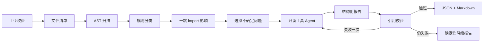
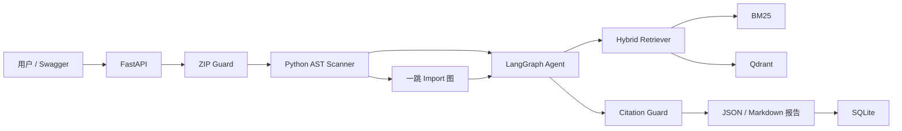

# MigrationLens 三周项目规格书

副标题：Pydantic v1→v2 升级影响分析 Agent

## 1. 项目一句话

用户上传 Python 项目 ZIP 后，系统**不运行、不修改代码**，而是通过 Python AST 静态分析定位 Pydantic v1 用法，结合固定版本的官方迁移文档 RAG，生成包含文件、行号、风险等级、受影响模块、迁移建议和官方出处的报告。

## 2. 为什么值得写进 AI 应用开发简历

它不是普通知识库问答，而是把 LLM 放在一条有确定性工具、证据约束和失败降级的工程链路中：

- AST 负责发现事实。
- 规则系统负责风险分类。
- RAG 负责找到官方迁移依据。
- Agent 负责处理不确定项、组织工具调用和形成报告。
- Citation Guard 负责禁止伪造引用。
- FastAPI 和 Docker 负责可复现交付。
- 锁定 fixture 和评测脚本负责证明准确率。

Pydantic 官方已经提供迁移指南并提到 `bump-pydantic` 转换工具，因此项目不要再定位成“自动迁移器”。项目的差异应是**只读影响审查、行级定位、风险解释、证据引用和人工确认边界**。

官方来源：

- [Pydantic v1→v2 Migration Guide](https://docs.pydantic.dev/latest/migration/)
- [Pydantic GitHub 仓库](https://github.com/pydantic/pydantic)
- [Python ast 文档](https://docs.python.org/3/library/ast.html)

## 3. 目标用户和使用场景

### 目标用户

- 需要升级旧 Python 服务的开发者。
- 维护遗留 FastAPI/Pydantic 项目的小团队。
- 希望在升级前获得影响范围清单的代码审查人员。

### 典型输入

```text
shop-api.zip
report_language=zh-CN
llm_review=true
```

### 典型输出

```text
项目：shop-api
Python 文件：18
总代码行数：1460
Pydantic 模型：7
直接受影响文件：4
一跳依赖文件：3
高风险：3
中风险：2
需要人工确认：2

app/schemas/user.py:14
- 发现：class Config 中使用 orm_mode = True
- 风险：高
- 建议：检查 ConfigDict/from_attributes 迁移
- 一跳影响：app/api/users.py、app/services/user.py
- 官方依据：Changes to config
- human_review_required：true
```

同时返回 JSON 和 Markdown 报告。

## 4. 三周 MVP 边界

### P0 必须完成

- 仅支持 Pydantic v1→v2。
- 仅分析 ZIP 内 `.py` 文件。
- 8 类迁移规则。
- Python 标准库 `ast` 静态分析。
- 当前文件内的浅层类型追踪。
- 本地模块的一跳反向 import 关系。
- 固定版本官方迁移文档快照。
- BM25 + dense + RRF 混合检索。
- LangGraph 有限状态 Agent。
- 5 个只读工具。
- 引用 chunk allowlist。
- 无模型降级报告。
- FastAPI 同步分析接口。
- SQLite 保存分析结果。
- Qdrant 保存文档向量。
- Docker Compose。
- 40 个 fixture、32 条检索题。
- pytest、GitHub Actions、Locust。

### P1 有余力再做

- 一个原生 HTML/JS 上传页。
- 报告英文输出。
- 一跳 import 可视化。
- Prometheus `/metrics`。

### 明确不做

- 不支持 pandas、SQLAlchemy 等其他依赖。
- 不支持任意 Git URL。
- 不分析 notebook、Cython、模板或 JavaScript。
- 不执行 `pip install`、pytest 或用户代码。
- 不生成或应用补丁。
- 不实现跨函数、跨文件完整类型推断。
- 不提供 shell、Python 执行和任意网络工具。
- 不做 Redis、Celery、Kubernetes、多租户、登录。
- 不开发 React。

## 5. 八类迁移规则

| 规则族 | 典型旧用法 | 静态分析策略 | 默认风险 |
|---|---|---|---|
| BaseModel 方法改名 | `.dict()`、`.json()`、`.parse_obj()`、`.construct()`、`.copy()`、`.schema()`、`.schema_json()`、`.update_forward_refs()` | 只有接收者可追踪为 BaseModel 实例时高置信命中 | 中 |
| 数据加载 | `parse_raw`、`parse_file`、`from_orm` | 检测 attribute call，提示行为变化 | 高 |
| 配置系统 | `class Config`、`orm_mode`、`schema_extra`、`allow_population_by_field_name` | BaseModel 子类内部类与赋值检测 | 高 |
| 验证器 | `@validator`、`@root_validator`、`@validate_arguments` | decorator 名称和 import alias | 高 |
| Field 参数 | `regex`、`min_items`、`max_items`、`allow_mutation`、`const`、`unique_items` | `Field(...)` 关键字参数 | 中 |
| Settings | `from pydantic import BaseSettings` | import/from import | 高 |
| 泛型模型 | `GenericModel` | import 和类继承 | 中 |
| 根模型 | `__root__` | BaseModel 子类字段检测 | 中 |

### 两阶段静态分析

第一阶段建立符号表：

- import alias。
- `BaseModel` 子类。
- `GenericModel`、`BaseSettings` 导入。
- 函数参数类型。
- 简单赋值类型。
- 本地模块名与文件路径。

第二阶段匹配规则：

- 方法调用。
- decorator。
- class Config。
- Field 调用。
- import。
- `__root__` 字段。

### 置信度

- `high`：AST 能确认对象或上下文属于 Pydantic。
- `medium`：符号高度相关，但浅层类型追踪不完整。
- `low`：仅字符串或名称相似，不进入正式 finding。

无法确认的 `.dict()`、`.json()` 等不得强判为 Pydantic 问题，应进入 `human_review_required`。

## 6. 数据方案

### 6.1 官方文档快照

不要每次启动都抓取变化中的在线页面。开发时：

1. 在 Pydantic GitHub 仓库选择实际 tag 或 commit。
2. 下载该 ref 的 `docs/migration.md`。
3. 保存原始 Markdown。
4. 计算 SHA256。
5. 记录 URL、ref、抓取时间和许可证。
6. 同时保存该 ref 的上游 `LICENSE`，并在 `THIRD_PARTY_NOTICES.md` 保留版权与归属；项目自己的 `LICENSE` 不能替代上游文档许可证。

建议 manifest：

```json
{
  "source_id": "pydantic-v2-migration",
  "upstream_repo": "https://github.com/pydantic/pydantic",
  "git_ref": "<actual-tag-or-commit>",
  "path": "docs/migration.md",
  "retrieved_at_utc": "<timestamp>",
  "sha256": "<sha256>",
  "license": "MIT",
  "license_path": "third_party/pydantic-LICENSE",
  "attribution_path": "THIRD_PARTY_NOTICES.md"
}
```

### 6.2 Fixture 数据集

总共 40 个小型 fixture：

- 24 个正例：8 类规则，每类 3 个变体。
- 8 个负例：普通对象的 `.dict()`、`.json()`、普通 `Config` 类等。
- 8 个混合小项目：每个包含 3–6 个问题和本地 import。

每个 fixture：

- 1–4 个 Python 文件。
- 30–200 LOC。
- 不依赖网络。
- 不需要真的安装 Pydantic。

划分：

- dev：12 个，可调试；8 个单规则正例、2 个负例、2 个混合项目。
- locked test：28 个；16 个单规则正例、6 个负例、6 个混合项目。
- 第 6 天开始持续建立 fixture，第 13 天只做人审、hash 和锁定，不在一天内临时生成全部数据。

标签：

```json
{
  "fixture_id": "config_orm_mode_02",
  "file": "app/models/user.py",
  "rule_id": "PD_CONFIG_RENAMED",
  "start_line": 14,
  "expected": true,
  "severity": "high",
  "gold_heading": "Changes to config"
}
```

必须生成：

```text
data/manifests/fixtures.json
data/manifests/eval_lock.json
```

`eval_lock.json` 记录 locked 文件和标签的 SHA256，防止为了提高成绩修改测试集。

### 6.3 检索题

制作 32 条问题，每类规则 4 条：

- dev：12 条，用于调试切分、检索参数和 query 改写。
- locked test：20 条，锁定后不得继续调检索参数或 prompt。

示例：

- How should `orm_mode` be migrated in Pydantic v2?
- What replaces `BaseModel.parse_obj`?
- What changed for `@root_validator`?
- Where should `BaseSettings` be imported from?

gold 应标到 `heading_path`，不要依赖可能随切分变化的数组序号。

## 7. RAG 设计

### 7.1 切分

- 按 Markdown H2/H3 标题。
- 代码块不得从中间截断。
- 目标 500–1200 字符。
- 超长章节按段落切分。
- overlap 100–150 字符。

元数据：

```json
{
  "chunk_id": "sha256-prefix",
  "heading_path": ["Migration Guide", "Changes to config"],
  "source_url": "...",
  "git_ref": "...",
  "text_sha256": "..."
}
```

### 7.2 Embedding

默认使用：

```text
intfloat/multilingual-e5-small
```

原因：

- 约 0.1B 参数，显著小于 BGE-M3。
- 支持中英文跨语言检索。
- 384 维向量，Qdrant 容器占用较低。
- 适合几十到一百多个文档块的三周项目。

注意按模型要求使用：

```text
query: ...
passage: ...
```

### 7.3 混合检索

1. `rank-bm25` top-8。
2. Qdrant dense top-8。
3. Reciprocal Rank Fusion。
4. top-3 进入 Agent。

查询格式：

```text
rule_id + old_api + AST context + user question
```

示例：

```text
PD_CONFIG_RENAMED orm_mode class Config BaseModel migration Pydantic v2
```

不加入 cross-encoder reranker。

### 7.4 检索返回

```json
{
  "chunk_id": "migration-config-a1b2",
  "heading_path": ["Migration Guide", "Changes to config"],
  "text": "...",
  "source_url": "...",
  "bm25_rank": 1,
  "dense_rank": 3,
  "rrf_score": 0.032
}
```

## 8. Agent 设计

### 8.1 Agent 的真实职责

高置信度 AST finding 不由 LLM 决定。LLM 只负责：

- 选择不确定问题需要补充的官方证据。
- 调用只读工具查看局部上下文。
- 组织结构化报告。
- 对无法确定的项目给出检查建议。

### 8.2 只读工具

```text
get_findings(rule_id?, severity?)
get_source_context(path, line, radius<=15)
get_local_importers(path)
search_official_docs(query, top_k<=5)
lookup_rule_spec(rule_id)
```

每个工具必须：

- 使用 Pydantic 输入输出。
- 有超时。
- 有最大输出长度。
- 记录 trace。
- 拒绝越界路径。

### 8.3 图状态

```python
class AnalysisState(TypedDict):
    analysis_id: str
    repo_summary: dict
    findings: list[dict]
    ambiguous_groups: list[dict]
    retrieved_chunks: dict[str, list[dict]]
    agent_steps: int
    draft_report: dict | None
    validation_errors: list[str]
    degraded_reason: str | None
```

### 8.4 图流程



### 8.5 运行限制

- 每个上传只运行一次 Agent。
- 最多处理 8 组不确定问题。
- 最多 8 次工具调用。
- LLM 超时 20 秒。
- 引用校验最多重试一次。
- Agent 总时间上限 45 秒。
- 无 API Key 时直接生成确定性报告。

## 9. 引用校验

报告只能引用当前分析中实际检索返回的 chunk ID。

引用评测必须拆成两层：

- `citation_validity`：引用 ID、URL、ref 和 hash 是否来自 allowlist，可自动验证。
- `citation_support`：该段文档是否真正支持迁移建议，必须对抽样 finding 人工核验；不能把关键词重合写成“语义支持率”。

校验器检查：

- `chunk_id` 在 allowlist。
- URL 与 source manifest 一致。
- heading 存在。
- finding 的 `rule_id` 与检索问题一致。
- 引用文本至少包含旧 API 名或规则关键词。

故意输出未知 chunk ID 时：

1. 拒绝报告。
2. 允许一次重试。
3. 仍失败则进入模板降级。

## 10. ZIP 安全边界

至少实现：

- 仅允许 ZIP。
- 压缩文件最大 2 MiB。
- ZIP 成员总数不超过 200。
- 单个解压文件不超过 1 MiB。
- 解压后总量不超过 10 MiB。
- 单成员压缩比不超过 100。
- 最多 200 个 `.py` 文件。
- 最大 50,000 LOC。
- 拒绝绝对路径。
- 拒绝 `..`。
- 拒绝符号链接。
- 限制单文件大小。
- 限制压缩比。
- 忽略 `.venv`、`venv`、`site-packages`、`node_modules`、`.git`。
- 不 import 上传模块。
- 不调用其中任何函数。
- 分析完成清理临时目录。

必须测试：

- 路径穿越 ZIP。
- 超大解压大小。
- 超高压缩比。
- 过多文件。
- 非 UTF-8 Python 文件。
- 软链接。

## 11. 整体架构



## 12. 目录结构

```text
migration-lens/
├─ app/
│  ├─ main.py
│  ├─ api/
│  │  ├─ analyses.py
│  │  ├─ reports.py
│  │  ├─ rules.py
│  │  └─ health.py
│  ├─ core/
│  │  ├─ config.py
│  │  ├─ logging.py
│  │  └─ llm.py
│  ├─ domain/
│  │  ├─ finding.py
│  │  ├─ report.py
│  │  └─ source.py
│  ├─ security/
│  │  └─ zip_guard.py
│  ├─ scanner/
│  │  ├─ inventory.py
│  │  ├─ imports.py
│  │  ├─ type_hints.py
│  │  ├─ registry.py
│  │  └─ rules/
│  ├─ ingestion/
│  │  ├─ chunker.py
│  │  └─ indexer.py
│  ├─ retrieval/
│  │  ├─ dense.py
│  │  ├─ lexical.py
│  │  ├─ fusion.py
│  │  └─ service.py
│  ├─ agent/
│  │  ├─ state.py
│  │  ├─ tools.py
│  │  ├─ nodes.py
│  │  └─ graph.py
│  ├─ reporting/
│  │  ├─ renderer.py
│  │  └─ citation_guard.py
│  └─ storage/
│     └─ sqlite.py
├─ scripts/
│  ├─ fetch_pydantic_docs.py
│  └─ build_index.py
├─ data/
│  ├─ raw/
│  ├─ manifests/
│  ├─ fixtures/
│  │  ├─ dev/
│  │  └─ test_locked/
│  ├─ labels/
│  └─ retrieval_eval/
├─ benchmarks/
├─ eval/
│  ├─ detection.py
│  ├─ retrieval.py
│  ├─ e2e.py
│  └─ load.py
├─ tests/
│  ├─ unit/
│  ├─ integration/
│  └─ api/
├─ reports/
├─ Dockerfile
├─ compose.yaml
├─ pyproject.toml
├─ .env.example
├─ SPEC.md
├─ AGENTS.md
├─ THIRD_PARTY_NOTICES.md
└─ README.md
```

## 13. API

### `POST /api/v1/analyses`

`multipart/form-data`：

```text
file: ZIP
report_language: zh-CN | en
llm_review: true | false
```

MVP 同步返回，不引入后台队列。

### `GET /api/v1/analyses/{analysis_id}`

返回保存的 JSON。

### `GET /api/v1/analyses/{analysis_id}/report.md`

下载 Markdown。

### `GET /api/v1/rules`

返回支持规则和局限。

### `GET /health/live`

验证 API 进程。

### `GET /health/ready`

验证 SQLite、文档索引，以及当前配置的 retriever backend。正式 profile 使用 Qdrant；如果通过经记录的降级决策切换为本地 dense index，readiness 应检查实际 backend，不能永远硬编码 Qdrant。

### 输出 schema

```json
{
  "analysis_id": "uuid",
  "status": "completed",
  "scanner_version": "0.1.0",
  "document_ref": "<locked-ref>",
  "model": "<actual-model>",
  "repository": {
    "python_files": 18,
    "loc": 1460,
    "directly_affected_files": 4,
    "one_hop_dependent_files": 3
  },
  "summary": {
    "high": 3,
    "medium": 2,
    "human_review": 2
  },
  "findings": [],
  "timings_ms": {
    "extract": 0,
    "scan": 0,
    "retrieve": 0,
    "llm": 0,
    "total": 0
  },
  "degraded_reason": null
}
```

## 14. 评测

### 14.1 静态检测

在 28 个 locked fixture 上报告：

- Precision。
- Recall。
- F1。
- 每类规则 Precision/Recall。
- 负例误报。
- 一跳 importer 准确率。

匹配键：

```text
(file, line, rule_id)
```

扫描器消融只比较同一任务：

1. regex/grep 规则基线。
2. AST 名称匹配。
3. AST + import alias + 浅层类型追踪。

三组均使用 finding F1、line-location accuracy 和负例误报率，不能与 RAG Recall 放在同一张“准确率”表中。

建设目标：

- Precision ≥ 0.92。
- Recall ≥ 0.85。
- locked test 中 6 个负例不超过 1 个误报。

这些是验收目标，不是简历数字。

### 14.2 RAG

32 条问题，其中 12 条 dev、20 条 locked test。最终报告以 20 条 locked test 为准：

- Recall@1。
- Recall@3。
- MRR@5。

对比：

1. BM25 only。
2. Dense only。
3. BM25 + Dense + RRF。

检索消融单独报告 Recall/MRR；它不与 regex/AST 的 finding 指标直接比较。

目标：

- Hybrid Recall@3 ≥ 0.90。
- Hybrid 不低于两个单路基线。

### 14.3 Agent

客观指标：

- 结构化输出成功率。
- 引用 chunk 合法率。
- finding 字段完整率。
- LLM 超时后的降级成功率。
- 平均工具调用数。
- 平均 token。

人工抽查 20 条 finding，检查引用是否真正支持建议。

### 14.4 性能

分开测：

1. 关闭 LLM：50 个文件、约 10k LOC，运行 50 次。
2. FakeLLM：5/10 并发，2–5 分钟。
3. 真实模型：若完成请求数不少于 50，报告 p50、p95、失败率和 token；若因成本只完成 10–49 次，只报告 median、min–max、失败率和样本量，不写 p95。

不要把 FakeLLM 延迟写成真实模型延迟。

### 14.5 产物

```text
reports/detection_metrics.json
reports/retrieval_metrics.csv
reports/retrieval_ablation.csv
reports/e2e_latency.json
reports/manual_citation_audit.csv
reports/eval_manifest.json
reports/loadtest.json
reports/failures.md
```

## 15. 15 个工作日

### 第 1 周

- Day 1：SPEC、仓库、FastAPI health、Docker。
- Day 2：固定 ref 文档下载、hash、许可证。
- Day 3：chunker、embedding、Qdrant。
- Day 4：BM25、dense、RRF。
- Day 5：12 条 dev 检索题、首批 4 个 fixture。

### 第 2 周

- Day 6：ZIP Guard、补齐 12 个 dev fixture。
- Day 7：import alias、BaseModel 类、模块映射。
- Day 8：前四类规则、同步增加候选 locked fixture。
- Day 9：后四类规则、浅层类型追踪、同步增加候选 locked fixture。
- Day 10：20 条 locked 检索题、dev 消融和候选 fixture 复核。

### 第 3 周

- Day 11：LangGraph、五个工具、FakeLLM，继续补齐候选 locked fixture。
- Day 12：API、SQLite、Markdown、超时、降级、Citation Guard。
- Day 13：人工核对 28 个 locked fixture 和 20 条 locked 检索题，生成 hash 后冻结。
- Day 14：只运行一次 locked 评测并记录失败；不得根据 locked 个案修改规则、检索参数或 prompt。
- Day 15：clean clone、CI、安全检查、README、Release、演示和真实简历数字。若 locked 暴露行为缺陷，将其记录为 limitation，修复后必须建立新的未见 holdout 版本。

## 16. 降级策略

| 风险 | 降级 |
|---|---|
| 模型 API 不可用 | `LLM_REVIEW=false`，输出确定性报告 |
| Embedding 下载失败 | BM25 only，并标记 `lexical_degraded` |
| Qdrant 连接问题 | 通过 `DECISIONS.md` 和新版 SPEC 正式切换本地 NumPy cosine，readiness、README 和简历只描述实际 backend |
| `.dict()` 误报多 | 只有能确认 BaseModel 实例才高置信命中 |
| Agent 引用幻觉 | allowlist、一次重试、模板降级 |
| 工期不足 | 删除 HTML 页和一跳影响图，不删除评测/RAG/Agent/Docker |

## 17. 简历模板

完成后用真实数字替换：

> **MigrationLens：Pydantic v1→v2 升级影响分析 Agent**  
> Python / FastAPI / LangGraph / AST / `{actual_retriever_backend}` / Docker
>
> - 基于 Python AST 构建 Pydantic v1→v2 只读迁移分析器，覆盖 8 类 API 与配置变化，并通过本地 import 图定位一跳受影响文件；在 28 个锁定 fixture 上取得 Precision `{x}`、Recall `{y}`、F1 `{z}`。
> - 对固定版本官方迁移文档实现 BM25 与 multilingual-e5 向量混合检索及 RRF 融合，在 20 条锁定检索问题上达到 Recall@3 `{x}`，并通过 chunk allowlist 保证引用可追溯。
> - 使用 LangGraph 编排只读工具 Agent，加入最大步数、超时、结构化输出和无模型降级；通过 FastAPI 与 Docker Compose 部署，在 `{actual_completed_requests}` 次真实模型测试中报告 `{latency_stat_with_sample_size}` 和失败率 `{error_rate}`。

## 18. 面试必须能解释的问题

- 为什么选择 AST，而不是正则或 Tree-sitter？
- 如何避免把普通对象的 `.dict()` 误报为 Pydantic？
- 为什么 LLM 不负责决定高置信 finding？
- BM25、dense 和 RRF 分别解决什么问题？
- 什么是 locked test，为什么锁定后不能继续调 prompt？
- 引用 allowlist 如何阻止模型编造来源？
- 为什么不自动执行或修改用户代码？
- FakeLLM 压测和真实模型压测有什么区别？
- 如果模型 API 完全不可用，系统还能提供什么价值？
