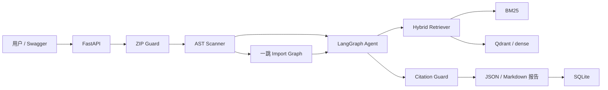

# MigrationLens 项目说明与每日开发计划

更新时间：2026-08-07
产品：MigrationLens — Pydantic v1→v2 升级影响分析 Agent
权威范围：`SPEC.md`

## 1. 项目概述

### 1.1 一句话介绍

用户上传 Python 项目 ZIP 后，MigrationLens 不运行、不修改其中的代码，而是通过
Python AST 定位受支持的 Pydantic v1 用法，从固定版本的官方迁移文档中检索证据，
再生成包含文件、行号、风险、影响范围、迁移指导、人工确认项和官方出处的 JSON 与
Markdown 报告。

### 1.2 目标用户

- 正在升级旧版 Python 服务的开发者；
- 维护遗留 FastAPI/Pydantic 项目的小团队；
- 在实际修改前需要升级影响清单和官方依据的审查人员。

### 1.3 输入与输出

P0 输入：

- 一个通过安全校验的 ZIP；
- `report_language=zh-CN`；
- `llm_review=true|false`。

P0 输出：

- 仓库 Python 文件数、代码行数和 Pydantic 模型摘要；
- 直接受影响文件和一跳依赖文件；
- `rule_id`、文件、行列、证据、置信度、风险和人工复核标记；
- 对应官方文档 chunk、URL、ref、heading 和内容 hash；
- JSON 报告和内容一致的 Markdown 报告；
- 分阶段 timings、模型/回退状态和限制。

### 1.4 项目价值与边界

这不是普通知识库问答。AST 发现事实，规则系统分类，RAG 提供官方依据，Agent
只处理不确定项和组织报告，Citation Guard 禁止伪造来源，locked fixture 与评测
脚本验证结果。

Pydantic 官方已有迁移指南和自动转换工具，因此 MigrationLens 不定位为自动迁移器。
它的差异是只读影响审查、行级定位、风险解释、引用追溯和人工确认边界。

参考来源：

- [Pydantic v1→v2 Migration Guide](https://docs.pydantic.dev/latest/migration/)
- [Pydantic GitHub](https://github.com/pydantic/pydantic)
- [Python `ast` 文档](https://docs.python.org/3/library/ast.html)

## 2. 当前真实进度

### 2.1 状态定义

| 状态 | 含义 |
|---|---|
| `completed` | 当日完整目标、约定集成边界和验收证据均完成 |
| `implementation_complete` | 本日限定实现与测试完成，但尚未接入后续运行时边界 |
| `runtime_verified` | 已在真实应用/容器生命周期中验证；只有实际运行后才能使用 |
| `planned` | 尚未实施，不得写成完成证据 |

### 2.2 MigrationLens Day 1

状态：`completed`
基础与中文化日期：2026-08-04
用户 FakeLLM 手动练习日期：2026-08-05

Day 1 合并以下历史工作，不再把中文化或手动练习计算为独立开发日：

- FastAPI 应用工厂 `create_app(settings=None)`；
- `GET /health/live`，且不查询外部依赖；
- Pydantic Settings；
- 基于标准库的结构化 JSON 日志和幂等 handler 配置；
- 类型化 `LLMClient`、`LLMRequest`、`LLMResponse` 与确定性 `FakeLLM`；
- pytest、Ruff 和 PEP 621 项目配置；
- 项目 Markdown、配置说明、Python 注释和文档字符串中文化；
- 用户将 FakeLLM 默认响应改为
  “MigrationLens 离线模拟响应：未调用真实大模型。”并增加精确测试。

历史证据必须按日期区分：

- 2026-08-04 Day 1 基础和中文化：完整测试集
  `15 passed, 1 warning`；Ruff 与真实 `/health/live` 验证通过；
- 2026-08-05 FakeLLM 手动练习：LLM 单测 `4 passed`，当时完整测试集
  `16 passed`。

不能把 8 月 5 日新增的第 16 个测试回填为 8 月 4 日的证据，也不能把 FakeLLM
结果当成真实模型质量或延迟。

### 2.3 MigrationLens Day 2

状态：`implementation_complete`
日期：2026-08-05

已实现：

- 声明并验证 `aiosqlite==0.22.1`；
- SQLite 路径与 `timeout` 配置和校验；
- 管理单个异步连接的 `SQLiteDatabase`；
- `NEW`、`INITIALIZED`、`FAILED`、`CLOSED` 生命周期；
- 只创建 `system_metadata`；
- 以 `INSERT OR IGNORE` 初始化 `schema_version=1` 和
  `document_index_status=not_built`；
- 重复初始化、重新打开、`ping`、`read_metadata` 和幂等 `close`；
- 预期的 `sqlite3.Error`/`OSError` 转为安全失败状态；
- `RuntimeError`、`KeyboardInterrupt` 和 `SystemExit` 等未预期异常不被吞掉；
- 局部连接在未预期失败传播前关闭；
- 日志只输出 `component` 与 `error_type` 白名单字段，不泄露路径、异常原文或堆栈。

历史限定证据：

- SQLite 相关最终限定测试：`25 passed in 0.22s`；
- 限定 Ruff check：`All checks passed!`；
- 限定 Ruff format check：`7 files already formatted`；
- `git diff --check`：退出码 0。

`25 passed` 是限定测试集，不是当时或当前仓库的完整测试数量。

在 Day 2 完成时，以下内容尚未实现：

- `ApplicationDependencies` 和 FastAPI lifespan（后于 Day 3 完成）；
- `/health/ready`（后于 Day 4 完成）；
- analyses/reports 表；
- Embedding、Qdrant、Docker、GitHub Actions。

Day 2 的历史状态仍为 `implementation_complete`，不能用后续 Day 的接线结果把它
改写为 `completed` 或 `runtime_verified`。

### 2.4 2026-08-06 当前基线

本次文档重构前实际运行：

- `python -m pip check`：`No broken requirements found.`；
- `python -m pytest -q`：`34 passed, 1 warning in 0.48s`；
- `python -m ruff check .`：`All checks passed!`；
- `python -m ruff format --check .`：`27 files already formatted`。

唯一警告为 FastAPI TestClient 导入触发的上游
`StarletteDeprecationWarning`，没有被过滤隐藏。

当前代码中还没有官方文档快照、chunker、索引、ZIP Guard、AST scanner、import
graph、八类规则、RAG、LangGraph、五个工具、Citation Guard、业务分析 API、
报告存储、benchmark、Locust、真实 LLM 或 WDI 业务实现。

同日后续已完成 Day 3 的应用级依赖与 SQLite lifespan，以及 Day 4 的
`ReadinessService` 和 `/health/ready`。默认 ready=503，因为索引仍为
`not_built` 且 retriever backend 尚未配置。

## 3. P0、P1 和不做范围

### 3.1 P0 必须完成

- 仅支持 Pydantic v1→v2；
- 仅支持 ZIP 输入和普通 `.py` 文件分析；
- 八类迁移规则；
- 标准库 `ast` 静态分析；
- 当前文件内浅层类型追踪；
- 本地模块一跳反向 import；
- 固定官方迁移文档快照、来源元数据、SHA256、上游许可证和归属；
- BM25 + dense + RRF；
- `intfloat/multilingual-e5-small`，严格使用 `query:`/`passage:`；
- Qdrant 正式 dense backend；
- LangGraph 有限状态 Agent 和五个只读工具；
- 引用 chunk allowlist、最多一次引用重试和无模型确定性回退；
- 同步 FastAPI 分析端点；
- SQLite 保存分析摘要和报告；
- Docker Compose；
- 40 个 fixture：12 dev、28 locked；
- 32 条检索题：12 dev、20 locked；
- pytest、GitHub Actions、Locust、机器可读评测和失败记录；
- P0 报告仅输出 `zh-CN`。

### 3.2 P1

- 原生 HTML/JavaScript 上传页面；
- 英文报告；
- 一跳 import 可视化；
- Prometheus `/metrics`。

在 P0 发布门槛通过前不得开始 P1。

### 3.3 明确不做

- Pydantic 之外的其他依赖迁移；
- 任意 Git URL；
- Notebook、Cython、模板或 JavaScript 分析；
- 对上传项目运行 `pip install`、pytest、import、函数或任何代码；
- 生成、应用或持久化代码补丁；
- 完整跨函数或跨文件类型推断；
- 向应用 Agent 提供 shell、任意 Python、任意网络或 Web 搜索工具；
- Redis、Celery、Kubernetes、认证、多租户、支付、React 或多 Agent；
- 模型训练或微调。

## 4. 八类迁移规则

| 规则类别 | 代表性 v1 用法 | 必需静态分析策略 | 默认风险 |
|---|---|---|---|
| BaseModel 方法重命名 | `dict`, `json`, `parse_obj`, `construct`, `copy`, `schema`, `schema_json`, `update_forward_refs` | 只有接收者可追溯为 BaseModel 实例时才高置信 | 中 |
| 数据加载 | `parse_raw`, `parse_file`, `from_orm` | 检测属性调用并说明行为变化 | 高 |
| 配置 | `class Config`, `orm_mode`, `schema_extra`, `allow_population_by_field_name` | BaseModel 子类、内部类和赋值 | 高 |
| 验证器 | `validator`, `root_validator`, `validate_arguments` | decorator 与 import alias | 高 |
| Field 参数 | `regex`, `min_items`, `max_items`, `allow_mutation`, `const`, `unique_items` | `Field(...)` 关键字参数 | 中 |
| Settings | `from pydantic import BaseSettings` | import 检测 | 高 |
| 泛型模型 | `GenericModel` | import 与继承 | 中 |
| 根模型 | `__root__` | BaseModel 子类内部字段 | 中 |

两阶段分析：

1. 建立 import alias、BaseModel 子类、相关导入、参数注解、简单赋值类型和本地
   模块映射；
2. 匹配方法、decorator、配置类、Field、import 和 `__root__`。

置信度为 `high`、`medium` 或 `low`。只有名称相似的 `low` 结果不进入正式 finding；
无法确认的 `.dict()`/`.json()` 可以成为人工复核候选，但不得冒充高置信 Pydantic
问题。分析只做浅层类型和一跳 import，不递归构建完整调用图。

## 5. 系统架构



组件职责：

- ZIP Guard：校验所有成员，只将普通 `.py` 文件交给扫描器；
- AST scanner：产生确定性 finding，不依赖 LLM；
- import graph：只报告一跳本地 importer；
- hybrid retriever：从固定官方快照返回可追溯 chunk；
- Agent：对有限歧义项选择证据并组织报告；
- Citation Guard：校验本次 allowlist 与来源元数据；
- SQLite：保存摘要与报告，不保存上传 ZIP；
- Qdrant：正式 dense backend；
- FastAPI：同步 P0 接口、live 和 ready；
- 报告：JSON 与 Markdown 的 finding ID 和数量必须一致。

建议代码边界包括 `security/`、`scanner/`、`ingestion/`、`retrieval/`、`agent/`、
`reporting/` 和 `storage/`。这只是目标结构；当前真实代码仍只有基础
`app/api`、`app/core` 和 `app/storage/sqlite.py`。

## 6. 数据与文档快照

### 6.1 Pydantic 官方文档

计划 ref 为 `v2.13.4`，与当前 Pydantic 运行时版本一致。当前尚未实际抓取或验证，
因此没有可声明的文档快照 hash。

构建时必须：

1. 验证真实存在的 tag 或 commit；
2. 获取该 ref 的 `docs/migration.md`；
3. 保存原始 Markdown 和同 ref 的上游 `LICENSE`；
4. 记录 URL、ref、路径、UTC 获取时间、SHA256、许可证与归属；
5. 生成或更新 `THIRD_PARTY_NOTICES.md`；
6. 网络调用设置 timeout、最多三次重试、指数退避和原始缓存；
7. 下载失败时失败退出，不替换成模拟文档。

来源 manifest 至少包含：

```json
{
  "source_id": "pydantic-v2-migration",
  "upstream_repo": "https://github.com/pydantic/pydantic",
  "git_ref": "<actual-tag-or-commit>",
  "path": "docs/migration.md",
  "retrieved_at_utc": "<timestamp>",
  "sha256": "<sha256>",
  "license": "MIT",
  "license_path": "third_party/pydantic-LICENSE",
  "attribution_path": "THIRD_PARTY_NOTICES.md"
}
```

### 6.2 Fixture

P0 目标为 40 个小型 fixture：

- 24 个正例：8 类规则，每类 3 个变体；
- 8 个负例：普通 `.dict()`、普通 `Config` 等；
- 8 个混合项目：每个包含 3–6 个问题和本地 import。

每个 fixture 为 1–4 个 Python 文件、约 30–200 LOC，不依赖网络，也不要求安装
Pydantic。划分：

- dev 12：8 个单规则正例、2 个负例、2 个混合；
- locked 28：16 个单规则正例、6 个负例、6 个混合。

标签至少包含 `fixture_id`、`file`、`rule_id`、`start_line`、`expected`、
`severity` 和 `gold_heading`。`data/manifests/fixtures.json` 记录数据，
`eval_lock.json` 记录 locked 文件和标签 SHA256。

fixture 必须随规则开发持续建设；不能在冻结日临时生成全部样本。

### 6.3 检索题

共 32 条，每类规则 4 条：

- dev 12：调试 chunk、参数和 query；
- locked 20：冻结后不得继续调检索或 prompt。

gold 标到稳定的 `heading_path`，不依赖 chunk 数组序号。

## 7. RAG 设计

### 7.1 Markdown 切分

- 按 H2/H3 标题；
- 保持代码块完整；
- 目标 500–1200 字符；
- 超长章节按段落切分；
- 必要时 overlap 100–150 字符；
- 基于内容生成稳定 `chunk_id`；
- 保存 heading path、URL、git ref 和内容 SHA256。

### 7.2 Embedding

使用 `intfloat/multilingual-e5-small`：

- 约 0.1B 参数，适合小型官方文档索引；
- 支持中英文跨语言检索；
- 384 维向量；
- query 严格加 `query:`，文档严格加 `passage:`。

FakeEmbedding 只验证应用边界，不能作为真实检索质量证据。

### 7.3 混合检索

1. BM25 top-8；
2. Qdrant dense top-8；
3. Reciprocal Rank Fusion 融合和去重，融合参数 `k` 必须配置化并写入评测元数据；
4. top-3 进入 Agent。

查询由 `rule_id + old_api + AST context + user question` 组成。P0 不加入
cross-encoder reranker。结果必须包含 chunk ID、heading、文本、URL/ref、内容
hash、BM25/dense 排名和 RRF 分数。Qdrant 不可用时返回显式错误或经正式决策的
degraded 状态，不能伪装为空结果。

## 8. Agent 设计

### 8.1 真实职责

高置信 AST finding 不由 LLM 决定。Agent 只可以：

- 为不确定 finding 选择官方证据；
- 查看范围受限的局部源码上下文；
- 查看一跳 importer；
- 组织结构化报告；
- 说明需要人工复核的内容。

### 8.2 五个只读工具

```text
get_findings(rule_id?, severity?)
get_source_context(path, line, radius<=15)
get_local_importers(path)
search_official_docs(query, top_k<=5)
lookup_rule_spec(rule_id)
```

每个工具必须使用类型化输入输出、timeout、最大输出长度、trace/audit event 和路径
隔离，并测试成功、超时、空结果、非法参数和异常。Agent 没有 shell、写文件、代码
执行、Web 搜索或任意网络工具。

### 8.3 AnalysisState 与运行限制

状态至少包含：

```text
analysis_id
repo_summary
findings
ambiguous_groups
retrieved_chunks
agent_steps
draft_report
validation_errors
degraded_reason
```

每次分析：

- 最多 8 组歧义项；
- 最多 8 次工具调用；
- 每个 finding 最多接受一次模型审查；
- LLM timeout 20 秒；
- 引用失败最多重试一次；
- Agent 总时间不超过 45 秒；
- 没有 API key 或模型失败时生成确定性回退报告。

### 8.4 Citation Guard

报告只能引用本次分析检索返回的 chunk。自动 `citation_validity` 检查：

- chunk ID 位于 allowlist；
- URL、ref、heading 和 hash 与 manifest 一致；
- finding 的规则与检索 query 一致；
- 引用文本包含旧 API 或规则关键词。

`citation_validity` 只证明来源有效，不能证明文档在语义上支持建议。
`citation_support` 必须对抽样 finding 人工审查。未知、空或跨任务 chunk ID
应被拒绝；允许一次重试，仍失败则使用确定性模板。

最终 JSON 与 Markdown 报告必须明确分离：

- 确定性 AST/规则事实；
- 模型生成的解释；
- 需要人工复核的候选项。

模型解释不得覆盖、改写或伪装成确定性 finding。

## 9. API、存储和安全

### 9.1 API

- `POST /api/v1/analyses`：同步 multipart ZIP 分析，仅 `zh-CN`；
- `GET /api/v1/analyses/{analysis_id}`：保存的 JSON；
- `GET /api/v1/analyses/{analysis_id}/report.md`：Markdown；
- `GET /api/v1/rules`：规则和限制；
- `GET /health/live`：只检查 API 进程；
- `GET /health/ready`：检查 SQLite、文档索引和实际配置的 retriever backend。

readiness 不能硬编码 Qdrant；若 backend 经正式决策改变，必须检查并报告真实 backend。
业务请求应有大小限制、结构化错误、短 timeout 和错误脱敏。上传 ZIP 不持久化。

P0 响应中的说明性文本只使用 `zh-CN`。同步分析响应至少遵守以下契约：

```json
{
  "analysis_id": "uuid",
  "status": "completed",
  "scanner_version": "0.1.0",
  "document_ref": "<locked-ref>",
  "model": "<actual-model-or-deterministic-fallback>",
  "repository": {
    "python_files": 18,
    "loc": 1460,
    "directly_affected_files": 4,
    "one_hop_dependent_files": 3
  },
  "summary": {
    "high": 3,
    "medium": 2,
    "human_review": 2
  },
  "findings": [],
  "timings_ms": {
    "extract": 0,
    "scan": 0,
    "retrieve": 0,
    "llm": 0,
    "total": 0
  },
  "degraded_reason": null
}
```

`model` 必须记录实际模型标识或确定性回退标识，不能把 FakeLLM 或未调用模型的路径
写成真实模型。`document_ref` 必须对应本次使用的固定文档快照。

### 9.2 SQLite 与 Qdrant

当前 SQLite 只有 `system_metadata`，已在 Day 3 接入 lifespan。P0 后续才增加分析
摘要和报告存储。Qdrant collection 使用 384 维向量并保存完整来源 payload。两个
客户端都要可注入、有 timeout、生命周期关闭和故障测试。

### 9.3 ZIP 安全

- 压缩文件最大 2 MiB；
- 成员最多 200；
- 单个解压文件最大 1 MiB；
- 解压总量最大 10 MiB；
- 单成员压缩比最大 100；
- Python 文件最多 200；
- Python 总行数最多 50,000；
- 拒绝绝对路径、`..`、符号链接和重复覆盖；
- 忽略 `.venv`、`venv`、`site-packages`、`node_modules` 和 `.git`；
- 对所有成员先做安全与资源校验，只分析普通 `.py`，忽略安全非 Python 成员；
- 不 import、不调用、不修改上传代码；
- 结束后清理随机任务目录；
- 日志不记录源码正文、私有路径或异常原文。

测试必须覆盖正常 ZIP、Zip Slip、绝对路径、软链接、zip bomb/压缩比、大小、
成员数、重复路径和非 UTF-8 Python。

## 10. 评测与发布

### 10.1 Detection

在 28 个 locked fixture 上分别报告：

- Precision、Recall、F1；
- 每条规则 Precision/Recall；
- 负例误报；
- line-location accuracy；
- 一跳 importer accuracy。

匹配键为 `(file, line, rule_id)`。消融只比较 regex、AST 名称匹配、
AST + alias/浅层类型；不得与检索 Recall 混成一个“准确率”。

建设目标为 Precision ≥ 0.92、Recall ≥ 0.85、6 个 locked 负例不超过 1 个误报。
这些是目标，不是当前实测数字。

### 10.2 Retrieval

在 20 条 locked 检索题上分别报告 BM25、dense 和 hybrid 的 Recall@1、
Recall@3、MRR@5。建设目标为 Hybrid Recall@3 ≥ 0.90 且不低于两个单路基线；
目标不能写入简历。

### 10.3 Agent 与引用

- 结构化输出成功率；
- citation validity；
- finding 字段完整率；
- 回退成功率；
- 工具调用和 token；
- 人工抽查 20 条 finding 的 citation support。

没有独立 explanation gold 时，不宣称 Agent 提高了解释准确率或 detection recall。

### 10.4 性能与负载

分开报告：

1. scanner：50 个文件、约 10k LOC，运行 50 次；
2. FakeLLM：5/10 并发，验证应用基础设施；
3. 真实模型：每个并发档至少 50 个完成请求才报告 p50/p95；10–49 个只报告
   median、min–max、失败率和样本量。

FakeLLM 延迟不得描述为真实模型延迟。

### 10.5 locked 政策

- dev 与 locked 按模板族隔离；
- locked gold 必须由独立 reference evaluator 计算或复核；该 evaluator 不得 import
  被测 scanner、rules、Agent 或 tools；
- reference evaluator 必须记录独立的 commit/version，以及 gold 的计算过程、证据和
  人工复核记录；
- benchmark manifest 必须包含 `evaluator_version`；
- locked 答案在评测前人工审查并生成 hash；
- 用户完成人工复核并产生 frozen commit SHA，是开始最终 locked 评测的硬前置；
- 最终 locked 只在冻结 commit 上运行一次；
- 失败必须记录，不能据此修改行为；
- 行为改变后建立新的未见 holdout；
- frozen benchmark、代码、文档快照、模型和运行环境都写入评测元数据。

### 10.6 机器可读产物

```text
reports/eval.json
reports/detection_metrics.json
reports/retrieval_metrics.csv
reports/retrieval_ablation.csv
reports/e2e_latency.json
reports/manual_citation_audit.csv
reports/eval_manifest.json
reports/loadtest.json
reports/failures.md
reports/test-summary.txt
```

`reports/eval.json` 是聚合入口，记录 git commit、文档快照 hash、benchmark hash、
模型/Embedding 标识、evaluator version，并引用各组件报告；组件报告保留各自指标和
失败明细。`reports/test-summary.txt` 保存发布候选版本实际运行的测试命令和精确摘要。

只有测试、数据/文档 hash、评测、失败记录、Docker 启动、模型元数据、样本量、
负载测试和 clean clone 都有真实证据时，P0 才达到发布和简历门槛。

### 10.7 项目降级

| 风险 | 处理 |
|---|---|
| 模型 API 不可用 | `llm_review=false`，输出确定性报告 |
| Embedding 获取失败 | 明确 BM25-only degraded 状态；正式 backend 变化需决策和新版 SPEC |
| Qdrant 不稳定 | 先更新决策和 SPEC，才可切本地 cosine；所有文档写实际 backend |
| `.dict()` 误报高 | 只有确认 BaseModel 接收者才高置信，其余人工复核 |
| 引用幻觉 | allowlist、一次重试、模板回退 |
| 工期不足 | 删除 P1，不删除评测、RAG、Agent、Docker 或安全边界 |

## 11. 重新规划的每日开发计划

共同验收门禁：当日相关测试、完整 `pytest`、Ruff check、Ruff format check 和
`git diff --check`。修改部署时增加 `docker compose config`；Docker 可用时实际
build/up/health/down。外部网络、Docker、CI 或真实模型没有运行时必须写“未验证”。

| Day | 日期 | 状态 | 当日主目标 | 必须交付 | 验收方式 | 学习重点 | 明确不做 |
|---|---|---|---|---|---|---|---|
| MigrationLens Day 1 | 2026-08-04 | `completed` | 最小离线 FastAPI 骨架 | app factory、live、Settings、JSON 日志、LLMClient/FakeLLM；中文化与手动练习并入历史 | 8 月 4 日完整集 15 passed；8 月 5 日手动练习后 16 passed；历史 Ruff/live 证据 | 应用工厂、live、协议与 Fake 边界 | SQLite、ready、Embedding、扫描/RAG/Agent |
| MigrationLens Day 2 | 2026-08-05 | `implementation_complete` | SQLite 最小基础设施 | 配置、单连接、生命周期、metadata、ping/read/close、安全错误 | 历史限定集 25 passed；当前仍未接 lifespan | 异步资源、状态机、错误脱敏 | lifespan、ready、报告表、Qdrant |
| MigrationLens Day 3 | 2026-08-06 | `completed` | 依赖组装与 lifespan | `ApplicationDependencies`；startup 初始化和 shutdown 关闭 SQLite | 指定集 15 passed、完整集 44 passed；启停、失败清理、应用隔离和 live 不变 | FastAPI 生命周期与资源所有权 | ready、Embedding、Qdrant |
| MigrationLens Day 4 | 2026-08-06 | `completed` | ReadinessService 与 `/health/ready` | SQLite、索引状态、实际 retriever backend 检查和短 timeout | 指定集 64 passed、完整集 80 passed；真实 Uvicorn live=200、ready=503 | live 与 ready 的职责 | 实现 Qdrant/Embedding/索引 |
| MigrationLens Day 5 | 2026-08-07 | `completed` | Embedding 边界与 FakeEmbedding | 类型化 client、确定性 fake、维度/批量/timeout、前缀契约 | 指定集 30 passed、完整集 110 passed；无网络/模型文件/新依赖 | 可注入模型边界 | 下载真实模型、Qdrant、调参 |
| MigrationLens Day 6 | 2026-08-10 | `planned` | Qdrant 最小基础设施 | 可注入 client、384 维 collection、ping/init/close、受控错误 | backend 故障不得伪装空结果；共同门禁 | 向量后端生命周期 | Docker、写文档、RRF |
| MigrationLens Day 7 | 2026-08-11 | `planned` | Docker Compose 基线 | 非 root API 镜像、API+Qdrant、healthcheck、`.dockerignore` | compose config；可用时 up/live/ready/down；live 应成功，文档索引尚未构建时 ready 必须诚实报告 not-ready；共同门禁 | 容器边界与依赖健康 | CI、扫描器、P1 |
| MigrationLens Day 8 | 2026-08-12 | `planned` | 官方文档快照 | 验证 ref、迁移文档、LICENSE、manifest、hash、notices、cache | HTTP 成败/timeout/retry/cache；真实来源字段；共同门禁 | 可复现来源与许可证 | chunk、索引；未抓取不得称完成 |
| MigrationLens Day 9 | 2026-08-13 | `planned` | Markdown chunker | H2/H3、代码块、长度/overlap、稳定 ID、完整元数据 | 重复构建稳定、代码块和超长段落；共同门禁 | 内容寻址与结构切分 | BM25、dense、评测 |
| MigrationLens Day 10 | 2026-08-14 | `planned` | e5 稠密索引与检索 | 真实 adapter、passage 入库、query 检索、payload、top-8 | prefix、384 维、批量、empty index、故障；共同门禁 | e5 语义检索 | BM25、RRF、locked |
| MigrationLens Day 11 | 2026-08-15 | `planned` | BM25 + RRF 服务 | BM25 top-8、dense top-8、融合去重、top-3 和完整排名元数据 | 三路可独立调用、排序/空查询/单路失败；共同门禁 | lexical/dense 互补 | reranker、Agent、locked 调参 |
| MigrationLens Day 12 | 2026-08-17 | `planned` | dev 检索集与评分 | 32 题 schema、12 dev、20 locked 候选隔离、Recall/MRR evaluator | 三路 dev 报告、heading gold、无污染；共同门禁 | 评测分割与消融 | 查看 locked 成绩 |
| MigrationLens Day 13 | 2026-08-18 | `planned` | ZIP Guard | 全部资源/路径/成员规则、安全非 Python 忽略、清理 | 正常、穿越、绝对路径、链接、bomb、超限、编码；共同门禁 | 压缩包信任边界 | import/执行/修改代码、AST |
| MigrationLens Day 14 | 2026-08-19 | `planned` | AST 基础与符号表 | inventory、编码/语法、alias、BaseModel、类型线索、模块映射、registry | 空/BOM/语法/alias/稳定顺序；共同门禁 | AST 与确定性 schema | 八类规则、一跳 import、LLM |
| MigrationLens Day 15 | 2026-08-20 | `planned` | 前四类规则 | 配置、验证器、Settings、根模型；按本日规则增量建立候选 fixture | 每类 3 正2负1边界、行号 gold、同名负例；共同门禁 | 上下文敏感匹配 | 后四类、一次性补齐全部 fixture、Agent |
| MigrationLens Day 16 | 2026-08-21 | `planned` | 后四类规则 | 方法、数据加载、Field、GenericModel 和浅层 receiver；继续增量建立候选 fixture | 正负/alias、普通 `.dict()` 不高置信、low 不成 finding；共同门禁 | 置信度与人工复核 | 一跳 import、一次性补齐全部 fixture、完整类型推断 |
| MigrationLens Day 17 | 2026-08-22 | `planned` | 一跳反向 import | 本地 import graph、一跳 importer；只增量增加与一跳关系直接相关的混合候选 | 相对/绝对/cycle/同名/仅一跳；共同门禁 | 模块影响而非调用图 | 递归图、在本日补齐 40 个候选、锁定评测 |
| MigrationLens Day 18 | 2026-08-24 | `planned` | 五个只读 Agent 工具 | 类型化 I/O、白名单、timeout、上限、trace、路径隔离 | 每工具五类测试；无危险能力；共同门禁 | 工具契约与审计 | Agent 图、报告、API |
| MigrationLens Day 19 | 2026-08-25 | `planned` | 有界 LangGraph Agent | AnalysisState、歧义编排、限制、FakeLLM 与无模型回退 | 正常/timeout/无 key/超步数/一次重试；共同门禁 | 确定性逻辑优先 | Citation/API、Agent 改代码 |
| MigrationLens Day 20 | 2026-08-26 | `planned` | Citation Guard 与报告 | allowlist、来源校验、一次重试、模板回退、JSON/Markdown renderer | 伪造/空/跨任务拒绝，双格式一致；共同门禁 | validity 与 support | HTTP API、SQLite 报告表 |
| MigrationLens Day 21 | 2026-08-27 | `planned` | 分析 API 与报告持久化 | 四个业务 API、analyses/reports、`zh-CN`、错误脱敏、ZIP 不落盘 | HTTPX 成功/非法/回退/重启读取/OpenAPI；共同门禁 | API/存储事务边界 | 队列、英文、认证、P1 |
| MigrationLens Day 22 | 2026-08-28 | `planned` | benchmark 人工复核与冻结 | 12/28 fixture、12/20 检索题、模板族、独立 evaluator 版本、manifest/hash、eval lock 和 frozen commit SHA | 用户确认 gold、条数、类别、evaluator version 和 hash；记录 frozen commit SHA；本日不运行 locked | benchmark 独立性 | 看成绩、改 gold、调行为 |
| MigrationLens Day 23 | 2026-08-29 | `planned` | 自动化 locked 评测 | 在 frozen commit 上一次性运行 detection、retrieval、Agent 结构化输出和 citation validity，生成聚合及组件报告 | Day 22 frozen commit SHA 是硬前置；各自动 evaluator 只运行一次；共同门禁 | 冻结版本与自动证据 | 人工 citation support、性能测试、据 locked 修改或重跑 |
| MigrationLens Day 24 | 2026-08-31 | `planned` | 人工 citation support 与失败归档 | 人工审查 20 条 finding，完成 `manual_citation_audit.csv`、`failures.md` 和 `eval.json` 聚合 | 复核证据可追溯到 Day 23 frozen run；不重新运行或调优 locked；共同门禁 | 自动 validity 与人工 support | 性能、修复 locked 暴露的行为 |
| MigrationLens Day 25 | 2026-09-01 | `planned` | 性能与负载证据 | scanner、FakeLLM、条件式真实模型、硬件/commit/hash/sample | Locust、loadtest；样本规则和 Fake/real 分离；共同门禁 | 统计口径与样本量 | 样本不足填 p95、CI、发布文档 |
| MigrationLens Day 26 | 2026-09-02 | `planned` | CI 与安全门禁 | FakeLLM GitHub Actions、依赖检查、secret 扫描和发布候选安全测试摘要 | CI 实际运行；pytest/Ruff/安全测试精确结果写入 `reports/test-summary.txt`；共同门禁 | 离线 CI 与发布安全 | clean clone、Docker 复验、自动 commit/push |
| MigrationLens Day 27 | 2026-09-03 | `planned` | clean clone 与 Docker 复现 | 从干净目录按 README 构建；API+Qdrant compose；live、ready 和代表性分析请求 | clean clone pytest/Ruff/compose；实际 build/up/health/request/down；保存复现日志 | 可复现部署与真实 backend | 改业务行为、补写未运行结果、发布文案 |
| MigrationLens Day 28 | 2026-09-04 | `planned` | 发布文档与工程发布门槛 | README、架构、复现、安全、限制、许可证、演示脚本和全部证据索引一致；形成 v1.0 候选清单 | 全部发布门槛逐项映射到真实文件、命令、commit/hash；未通过项阻断发布 | 证据化交接与简历边界 | P1、补数字、自动 commit/push/tag 或公开发布 |

Days 15–17 只按当日规则或一跳边界增量建立候选 fixture，并持续记录数量与类别；
不得要求 Day 17 在一天内补齐 40 个候选。如果 Day 17 后仍有缺口，应在 Day 22 前
增加独立计划日，不能在冻结日临时生成。

Day 22 只做人审、独立 evaluator 复核、hash 和冻结；用户确认并产生 frozen commit
SHA 后，Day 23 才可开始。Day 23 只运行自动化 locked evaluator，Day 24 只进行人工
citation support 与失败归档。Day 23 后若改变行为，旧 locked 结果不能继续作为最终
证据。Days 25–28 分别负责性能、CI/安全、clean clone/Docker 和发布文档，不得重新
合并成一个发布日。

## 12. 历史编号迁移说明

| 旧编号 | 新编号 | 处理方式 |
|---|---|---|
| `M01-D1` | MigrationLens Day 1 | 保留最小离线骨架历史 |
| `M01-D1-CN` | MigrationLens Day 1 | 合并为 Day 1 的中文文档与学习记录 |
| FakeLLM 手动练习 | MigrationLens Day 1 | 合并为 Day 1 的用户学习证据，不另计开发日 |
| `M01-D2A-1` | MigrationLens Day 2 | 映射为 SQLite 最小基础设施，状态保持 `implementation_complete` |
| 原 `D2A-2` | MigrationLens Day 3 | 重新安排为依赖组装与 lifespan |
| 原 `D2A-3` | MigrationLens Day 4 及以后 | readiness 和其余独立模块分别安排，不沿用旧编号 |

旧编号只用于追溯历史。后续计划和提交统一使用 `MigrationLens Day N`。
