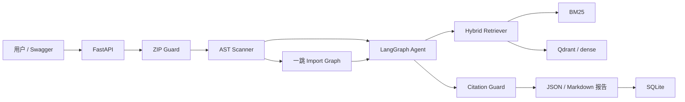

# MigrationLens 项目说明与每日开发计划

更新时间：2026-08-20
产品：MigrationLens — Pydantic v1→v2 升级影响分析 Agent
权威范围：`SPEC.md`

## 1. 项目概述

### 1.1 一句话介绍

用户上传 Python 项目 ZIP 后，MigrationLens 不运行、不修改其中的代码，而是通过
Python AST 定位受支持的 Pydantic v1 用法，从固定版本的官方迁移文档中检索证据，
再生成包含文件、行号、风险、影响范围、迁移指导、人工确认项和官方出处的 JSON 与
Markdown 报告。

### 1.2 目标用户

- 正在升级旧版 Python 服务的开发者；
- 维护遗留 FastAPI/Pydantic 项目的小团队；
- 在实际修改前需要升级影响清单和官方依据的审查人员。

### 1.3 输入与输出

P0 输入：

- 一个通过安全校验的 ZIP；
- `report_language=zh-CN`；
- `llm_review=true|false`。

P0 输出：

- 仓库 Python 文件数、代码行数和 Pydantic 模型摘要；
- 直接受影响文件和一跳依赖文件；
- `rule_id`、文件、行列、证据、置信度、风险和人工复核标记；
- 对应官方文档 chunk、URL、ref、heading 和内容 hash；
- JSON 报告和内容一致的 Markdown 报告；
- 分阶段 timings、模型/回退状态和限制。

### 1.4 项目价值与边界

这不是普通知识库问答。AST 发现事实，规则系统分类，RAG 提供官方依据，Agent
只处理不确定项和组织报告，Citation Guard 禁止伪造来源，locked fixture 与评测
脚本验证结果。

Pydantic 官方已有迁移指南和自动转换工具，因此 MigrationLens 不定位为自动迁移器。
它的差异是只读影响审查、行级定位、风险解释、引用追溯和人工确认边界。

参考来源：

- [Pydantic v1→v2 Migration Guide](https://docs.pydantic.dev/latest/migration/)
- [Pydantic GitHub](https://github.com/pydantic/pydantic)
- [Python `ast` 文档](https://docs.python.org/3/library/ast.html)

## 2. 当前真实进度

### 2.1 状态定义

| 状态 | 含义 |
|---|---|
| `completed` | 当日完整目标、约定集成边界和验收证据均完成 |
| `implementation_complete` | 本日限定实现与测试完成，但尚未接入后续运行时边界 |
| `runtime_verified` | 已在真实应用/容器生命周期中验证；只有实际运行后才能使用 |
| `planned` | 尚未实施，不得写成完成证据 |

### 2.2 MigrationLens Day 1

状态：`completed`
基础与中文化日期：2026-08-04
用户 FakeLLM 手动练习日期：2026-08-05

Day 1 合并以下历史工作，不再把中文化或手动练习计算为独立开发日：

- FastAPI 应用工厂 `create_app(settings=None)`；
- `GET /health/live`，且不查询外部依赖；
- Pydantic Settings；
- 基于标准库的结构化 JSON 日志和幂等 handler 配置；
- 类型化 `LLMClient`、`LLMRequest`、`LLMResponse` 与确定性 `FakeLLM`；
- pytest、Ruff 和 PEP 621 项目配置；
- 项目 Markdown、配置说明、Python 注释和文档字符串中文化；
- 用户将 FakeLLM 默认响应改为
  “MigrationLens 离线模拟响应：未调用真实大模型。”并增加精确测试。

历史证据必须按日期区分：

- 2026-08-04 Day 1 基础和中文化：完整测试集
  `15 passed, 1 warning`；Ruff 与真实 `/health/live` 验证通过；
- 2026-08-05 FakeLLM 手动练习：LLM 单测 `4 passed`，当时完整测试集
  `16 passed`。

不能把 8 月 5 日新增的第 16 个测试回填为 8 月 4 日的证据，也不能把 FakeLLM
结果当成真实模型质量或延迟。

### 2.3 MigrationLens Day 2

状态：`completed`
日期：2026-08-05

已实现：

- 声明并验证 `aiosqlite==0.22.1`；
- SQLite 路径与 `timeout` 配置和校验；
- 管理单个异步连接的 `SQLiteDatabase`；
- `NEW`、`INITIALIZED`、`FAILED`、`CLOSED` 生命周期；
- 只创建 `system_metadata`；
- 以 `INSERT OR IGNORE` 初始化 `schema_version=1` 和
  `document_index_status=not_built`；
- 重复初始化、重新打开、`ping`、`read_metadata` 和幂等 `close`；
- 预期的 `sqlite3.Error`/`OSError` 转为安全失败状态；
- `RuntimeError`、`KeyboardInterrupt` 和 `SystemExit` 等未预期异常不被吞掉；
- 局部连接在未预期失败传播前关闭；
- 日志只输出 `component` 与 `error_type` 白名单字段，不泄露路径、异常原文或堆栈。

历史限定证据：

- SQLite 相关最终限定测试：`25 passed in 0.22s`；
- 限定 Ruff check：`All checks passed!`；
- 限定 Ruff format check：`7 files already formatted`；
- `git diff --check`：退出码 0。

`25 passed` 是限定测试集，不是当时或当前仓库的完整测试数量。

在 Day 2 完成时，以下内容尚未实现：

- `ApplicationDependencies` 和 FastAPI lifespan（后于 Day 3 完成）；
- `/health/ready`（后于 Day 4 完成）；
- analyses/reports 表；
- Embedding、Qdrant、Docker、GitHub Actions。

Day 2 的历史状态仍为 `implementation_complete`，不能用后续 Day 的接线结果把它
改写为 `completed` 或 `runtime_verified`。

### 2.4 2026-08-06 当前基线

本次文档重构前实际运行：

- `python -m pip check`：`No broken requirements found.`；
- `python -m pytest -q`：`34 passed, 1 warning in 0.48s`；
- `python -m ruff check .`：`All checks passed!`；
- `python -m ruff format --check .`：`27 files already formatted`。

唯一警告为 FastAPI TestClient 导入触发的上游
`StarletteDeprecationWarning`，没有被过滤隐藏。

该基线时的代码中还没有官方文档快照、chunker、索引、ZIP Guard、AST scanner、import
graph、八类规则、RAG、LangGraph、五个工具、Citation Guard、业务分析 API、
报告存储、benchmark、Locust、真实 LLM 或 WDI 业务实现。

同日后续已完成 Day 3 的应用级依赖与 SQLite lifespan，以及 Day 4 的
`ReadinessService` 和 `/health/ready`。默认 ready=503，因为索引仍为
`not_built` 且 retriever backend 尚未配置。

### 2.5 MigrationLens Day 6

状态：`completed`
日期：2026-08-10

已实现 `QdrantClientProtocol`、官方 `AsyncQdrantClient` adapter 和最小
`QdrantBackend`。collection 固定复用 `EMBEDDING_DIMENSION=384` 并采用 D-010
记录的 Cosine；不存在时创建，已存在时校验，配置不匹配时不删除或 recreate。
initialize、ping、close 的外部异步调用都使用短 timeout，预期 Qdrant API/transport
失败转换为安全失败，程序错误继续传播。

本日只使用 FakeQdrantClient 验证工程契约，没有连接真实 Qdrant，也没有修改
`ApplicationDependencies`、FastAPI lifespan 或 readiness 接线。默认应用继续报告
retriever backend `not_configured`。真实 API + Qdrant 容器接线属于 Day 7；真实
e5、upsert 和 dense search 属于 Day 10。

### 2.6 MigrationLens Day 7

状态：`completed`
日期：2026-08-11

已新增 `Dockerfile`、`compose.yaml` 和 `.dockerignore`。API 镜像使用
`python:3.11.15-slim-bookworm` 并以 UID/GID `10001:10001` 非 root 运行；Compose
使用官方 `qdrant/qdrant:v1.18.3-unprivileged`，通过 `api_data` 与 `qdrant_data`
named volume 分离 SQLite/var 和 Qdrant storage。API 容器使用
`MIGRATIONLENS_QDRANT_URL=http://qdrant:6333`，不把容器自身 localhost 误当作
Qdrant。

`ApplicationDependencies` 现在同时拥有 SQLite、实际 `QdrantBackend` 和
`ReadinessService`，readiness 与 lifespan 使用同一个 backend。startup 按 SQLite、
Qdrant 顺序初始化，任一 required dependency 失败都阻止启动；shutdown 和失败清理按
Qdrant、SQLite 反向执行。`/health/live` 仍不访问外部依赖。离线集成测试确认当
SQLite=`ok`、Qdrant=`ok/qdrant`、document index=`not_built` 时，ready 仍为 HTTP
503，而不是为容器 healthcheck 伪造 200。

`docker compose config` 已实际通过，并确认两个 service、healthcheck、
`service_healthy` 依赖、ports、environment 与 named volumes。Docker Server 29.4.2
和 Compose v5.1.3 可用；隔离 project name 的真实 build/up/health/down 已通过。API
与 Qdrant 均 healthy；live HTTP 200；ready HTTP 503 且唯一未就绪项为预期的 document
index=`not_built`。真实 Qdrant collection 为 384 维 Cosine、points_count=0；API
实际 UID/GID=10001/10001 并通过 `http://qdrant:6333` 连接。API 与 Qdrant 均完成
优雅停止，本次 container、network、volume 与临时 API image 已隔离清理。因此 Day 7
状态为 `completed`，真实容器 runtime 已验证。

### 2.7 MigrationLens Day 8

状态：`completed`
日期：2026-08-12

已从官方仓库 `https://github.com/pydantic/pydantic` 验证 annotated tag `v2.13.4`；
tag object 为 `07b73712023f052c7c008c4a9c5121b4894e44ec`，peel 后 immutable commit 为
`cf67d4b3193c3fe43ede18612ed62785eee11382`。`docs/migration.md` 与 `LICENSE` 均从
该 commit 的 raw URL 获取，没有使用 `main`、`latest`、网页缓存或第三方转载。

正式 raw snapshot 位于 `data/snapshots/pydantic-v2-migration/migration.md`，大小
50,035 bytes，SHA256 为
`3a33c005259e6ede170df1904a168a4a64e8d8efc5b7fed360b65e5c000c05b7`。同 commit LICENSE
保存为 `third_party/pydantic-LICENSE`，大小 1,129 bytes，SHA256 为
`a9e186f3ca16b5eef84318e7a701721351a00cb7b8ae3a4394b67b49e3529ef3`。来源 manifest
位于 `data/manifests/pydantic-v2-migration.json`，归属位于
`THIRD_PARTY_NOTICES.md`，真实获取时间为 `2026-08-12T02:18:21Z`。

显式 builder 使用 Python 标准库 HTTP，timeout=15 秒；首次请求后最多三次 retry，
指数退避 0.5/1.0/2.0 秒。timeout、连接错误、408、429 与 5xx retry，404 等永久错误
立即失败。`var/cache/pydantic-snapshot/<commit>/` 保存 raw bytes 与并列 SHA256；有效
cache hit 不访问网络、不更新 retrieved timestamp。损坏 cache 明确失败，refresh 在
migration 与 LICENSE 全部获取和验证前不会覆盖已有正式 artifact。发布使用同目录
临时文件、fsync、`os.replace` 和 rollback，避免半成品 manifest。

首次真实命令报告 `source_state=downloaded`，第二次报告 `source_state=cache_hit`；
第二次运行四个正式 artifact 的 hash 与 mtime 均不变。本地重新读取 manifest、snapshot
和 LICENSE 后，两份 SHA256 与 byte length 均完全匹配。普通 pytest 使用 fake fetcher、
fake clock/sleeper 和临时目录，不访问 GitHub。Day 8 没有 chunk、embedding、Qdrant
upsert/search，也没有修改 `document_index_status=not_built`；Day 9 仍为 `planned`。

### 2.8 MigrationLens Day 9

状态：`completed`
实际开发日期：2026-08-12

Day 9 只读取并验证 Day 8 的正式 manifest 与 raw snapshot，在零网络条件下构建
`data/chunks/pydantic-v2-migration.json`。输入仍为 50,035 bytes、SHA256
`3a33c005259e6ede170df1904a168a4a64e8d8efc5b7fed360b65e5c000c05b7`、ref
`v2.13.4` 和 resolved commit
`cf67d4b3193c3fe43ede18612ed62785eee11382`；未读取 `var/cache`、未调用 Day 8
downloader，也未修改 snapshot、manifest、LICENSE 或 notices。

`app/ingestion/markdown_chunker.py` 使用标准库状态机跟踪 H2/H3、backtick/tilde 与
列表缩进 fence。H2 清除旧 H3，H3 继承最近 H2，preamble 使用空 path；chunk text
始终是原文精确 character slice。长度以 Python `len(text)` 计，目标 500–1200，
同 section continuation 的安全 overlap 固定为 120；短结构和 code-protection 例外
不会跨 heading 合并、填充或截断代码。

artifact 采用 deterministic JSON schema v1。每个 chunk 保存 stable SHA256 ID、
text SHA256、heading path、URL/ref/resolved commit、source snapshot hash、character
span 和 continuation metadata。ID 的 canonical input 不包含全局数组序号、绝对路径、
mtime 或 Python `hash()`。单文件发布使用 temporary sibling、flush、fsync 与
`os.replace`；相同 bytes 不重写。

真实构建为 62 chunks，artifact SHA256
`36ab67593a997edb81cf0385d74213471b95bf5c915e551e92461e88192b1773`；长度 106–1200，
目标范围 54、short structural 8、oversized 0、continuation 35、实际 overlap 27。
独立审计得到 62 个唯一 ID、0 collision、62 个唯一且匹配的 content hash、
188/188 source blocks、50,005/50,005 source characters、27/27 fenced blocks 和
0 coverage gap。第二次构建为 `unchanged`，artifact hash、有序 ID/content hash 与
mtime 均不变。

Day 9 没有 embedding、模型下载、Qdrant upsert/search、BM25/RRF 或 runtime wiring；
`document_index_status` 仍为 `not_built`，Day 10 仍为 `planned`。

### 2.9 MigrationLens Day 10

状态：`completed`
计划日期：2026-08-14
实际开发日期：2026-08-12

Day 10 以 Day 9 的 62-chunk JSON schema v1 artifact 为唯一 passage 输入，新增固定
revision 的真实 `intfloat/multilingual-e5-small` adapter。模型 revision 为
`614241f622f53c4eeff9890bdc4f31cfecc418b3`，直接依赖固定为
`sentence-transformers==5.6.1`；调用边界统一添加 `query: ` / `passage: `，输出固定
384 维、finite、L2-normalized。同步加载和 inference 通过 `asyncio.to_thread` 离开
event loop，加载、推理和 Qdrant 操作各自有 timeout；普通 pytest、import、startup 和
readiness 都不加载模型。

Day 9 chunk ID 通过固定 namespace UUIDv5 映射为 Qdrant point ID。payload 保留 chunk
text/heading/content hash、完整 URL/ref/resolved commit/snapshot/path/span provenance、
continuation metadata 和模型 ID/revision。显式 index builder 按 16 passages 分成 4
batches，使用 `wait=True` upsert；重复运行覆盖相同 IDs。只有精确 source count 与完整
ID 集合都通过 post-write verification，SQLite `document_index_status` 才从
`not_built` 变为 `ready`；partial failure、stale points 或验证失败不删除数据，也不
发布 ready。

真实首次模型运行下载 fixed revision 到 Git 已忽略的 `var/cache/huggingface`，设备为
CPU；query shape 为 1×384，passage shape 为 2×384，实测范数约为 1.00000001–
1.00000002。后续索引在 `HF_HUB_OFFLINE=1` 和 `TRANSFORMERS_OFFLINE=1` 下 cache hit。
真实 tokenizer audit 显示 62 chunks 中 6 个超过 512-token 上限，最大 572；按任务边界
不重切 Day 9 artifact，文档诚实记录 truncation。

隔离 Qdrant server 实际启动后，索引连续运行两次都得到 62 points、4 batches；独立
collection/scroll audit 为 green、384/Cosine、62 points、62 unique point IDs、62
unique chunk IDs，所有 payload chunk IDs 都属于 Day 9 artifact，模型身份一致。三条
真实 top-8 smoke 的 rank 1 分别命中 BaseModel 方法迁移、validator 迁移和
BaseSettings 移包；它们不构成 Recall/MRR 指标。同一 SQLite/Qdrant 环境下真实
Uvicorn `/health/ready` 返回 HTTP 200，三项检查分别为 SQLite `ok`、document index
`ready`、Qdrant `ok`。

Day 10 专项测试为 `138 passed in 0.94s`；完成文档前的完整回归为
`285 passed, 1 warning in 4.68s`，最终完整回归为
`285 passed, 2 warnings in 3.39s`。最终 warnings 是既有 Starlette TestClient 上游
弃用提示，以及 qdrant-client 在 Docker/Qdrant version probe 不可用时的 compatibility
提示；均没有过滤隐藏。Day 10 没有实现 BM25、RRF、hybrid、reranker 或 locked
retrieval evaluation；这些边界由下述 Day 11 独立实现。

### 2.10 MigrationLens Day 11

状态：`completed`
计划日期：2026-08-15
实际开发日期：2026-08-13

Day 11 以 Day 9 的 62-chunk JSON schema v1 artifact 和 Day 10 已验证的
`DenseRetriever` 为唯一输入。新增项目内、零新依赖的只读 BM25：Unicode-aware
casefold，保留 dotted/underscore/hyphen 复合 API token 并发出组件，baseline 固定
`k1=1.5`、`b=0.75` 和正平滑 IDF。BM25 只访问本地 artifact，top-k 固定上限 8；
合法 query 无正分 lexical hit 返回空 tuple，空/纯空白/纯标点和预加 embedding prefix
在 boundary 被拒绝。

HybridRetriever 原样调用 BM25 top-8 与 Day 10 Dense top-8，再按 `chunk_id` 去重并
计算 `sum(1/(rrf_k+rank_i))`。默认 `rrf_k=60` 是 Day 11 implementation choice，可由
`MIGRATIONLENS_RRF_K` 配置为 1..1000 正整数；raw BM25/cosine score 仅保留为证据，
不相加。完整融合 ranking 最多 16 个唯一候选，final view 固定 top-3；结果保存 final
rank、两路 optional rank/raw score、RRF score 和 Day 8–10 provenance。tie-break 依次
使用 RRF score、最佳 component rank、缺失按 9 计的 component rank 总和和 stable
chunk ID。provenance mismatch、duplicate ID 或非连续 rank 显式失败；当前没有
degraded mode，Dense/Qdrant failure 不伪装为空或 BM25-only hybrid。

Day 11 新增测试用例为 BM25 19、RRF 17、Hybrid orchestration 4、Settings 5，共 45
个；完整回归为 `330 passed, 2 warnings in 3.19s`。正式 artifact 执行 6 条 BM25
smoke；在强制 offline cache 下以 fixed-revision E5 和仓库固定 Qdrant image 重建并
验证 62 points/4 batches，再执行 4 条 Dense-only 与 Hybrid smoke。真实 top-3 保存
component ranks/RRF scores，重复 chunk 去重。smoke 不含 gold，不能描述为 Recall/MRR。

Day 11 没有修改 Day 9 artifact、Day 10 dense semantics、`pyproject.toml`、
`THIRD_PARTY_NOTICES.md`、`SPEC.md` 或 `AGENTS.md`，也没有实现 evaluator、locked data、
reranker、Agent、ZIP/AST 或 API。Day 12 保持 `planned`，明确消费三路独立接口与完整
ranking metadata。

### 2.11 MigrationLens Day 12

状态：`completed`
计划日期：2026-08-17
实际开发日期：2026-08-14

Day 12 新增 strict JSON question schema v1 与 evaluation-only 八类 `rule_category`，
不提前冻结尚未实现的 scanner production `rule_id`。32 题物理拆分为 12 条 dev 和
20 条 locked candidates；八类每类总计 4 条，question ID、normalized question text
与 template family 跨 split 不交叉。Gold 在运行 Retriever 前从固定 Day 8 snapshot 与
Day 9 headings 独立确认，使用稳定 `heading_path`；loader 还验证 gold 确实存在于正式
chunk artifact。

确定性 renderer 按固定顺序组合 rule category、old API、可选 AST-like context 和 user
question，只产生未加 prefix 的 raw query。BM25、Dense、Hybrid 三路接收完全相同的
query；Hybrid 指标读取完整 `results` 而不是 top-3 consumer view。Recall@1、Recall@3
与 MRR@5 分别按 exact heading equality 和 first relevant rank 计算，不合并为 overall
accuracy；infrastructure/contract failure 显式传播，不计为普通 miss。

Dev-only CLI 没有 `--split`、locked path 或 question path 参数，并要求显式 Hugging Face
offline mode。普通 50 个 Day 12 tests 全部使用 fake/stub ranking，不加载 E5/Qdrant。
第一次真实 CLI 因合法 preamble candidate 的空 heading 暴露新评测引用模型过严，未发布
任何 report；只修正 candidate path 允许为空并增加回归测试，没有改变 gold 或 Day 9–11
行为。

真实运行使用 fixed-revision E5 offline cache、CPU 和仓库自有 Qdrant。collection 重建并
核验为 62 points、384/Cosine、4 batches；三路 12-question dev 结果为：BM25
Recall@1/Recall@3/MRR@5=`0.916667/1.000000/0.944444`，Dense=
`0.416667/0.666667/0.555556`，Hybrid=`0.666667/0.833333/0.766667`。Hybrid 优于
Dense 但低于 BM25，结果原样保留且未调参。CSV、36-detail JSON 与 manifest 保存输入、
输出、模型、参数、Git dirty 和 runtime provenance；hash 已 round-trip 验证。

20 条 locked candidates 只做静态 schema/count/污染/gold-exists 校验，没有传入任何
Retriever：locked evaluation=`NOT RUN`。P0 明确不采用 cross-encoder reranker；Day 12
没有实现 reranker、ZIP/AST、Agent 或 API。完成后 Qdrant 容器恢复 stopped、volume
保留；Day 13 ZIP Guard 仍为 `planned`。

### 2.12 MigrationLens Day 13

状态：`completed`
计划与实际开发日期：2026-08-18

Day 13 新增独立 `app/security/zip_guard.py`，把不可信 ZIP 收敛为 context-scoped、
稳定排序的 validated Python files。七项冻结 hard limits 为 compressed upload 2 MiB、
200 members、1 MiB/member、10 MiB total、ratio 100、200 selected Python 和 50,000 LOC；
不能由环境变量调大，严格 limits 对象只允许收紧。

ZIP 压缩 bytes 先有界读入最多 2 MiB。所有 `ZipInfo` 都先经过跨平台 path、Unix/DOS
type、encryption、compression、size/total/ratio、duplicate 和 file/directory conflict
校验；全部普通文件再以 64 KiB 有界流读到 EOF，复核实际 bytes 和 CRC。只有所有成员、
Python UTF-8 与 LOC 都通过后才创建随机任务目录，并 exclusive-create selected `.py`。
安全非 Python、ignored directory 中的成员也完整验证和读取，只是不进入分析集合。

路径规则同时处理 `/`、`\` 和 mixed separators，拒绝 absolute、drive/UNC、`..`、NUL、
Windows ADS/保留名；destination 用 NFKC + casefold 识别 alias。成员类型只允许普通文件
和正常目录，拒绝 symlink、FIFO/device/socket、volume label、冲突目录 metadata 和未知
compression。Python 使用严格 `utf-8-sig`，允许开头 BOM 并原样保留 bytes；LOC 使用
`splitlines()`，空文件为 0，末尾单换行不额外加行。

`ZipGuardResult` 在 context 内提供随机绝对 task root、relative path、size、LOC、SHA256
和安全 inventory。正常退出、consumer 异常或受控写入失败都只清理本次随机目录；cleanup
幂等、不跟随 symlink/reparse point，瞬时删除失败保留 ownership 以便重试。错误日志仅含
固定 event、`component=zip_guard` 和白名单 `error_type`，不含源码、成员名、宿主路径或
原始异常。

测试先行红测为缺少 `app.security` 的 collection error。安全复核后 Day 13 定向测试为
`89 passed in 1.61s`，实现与文档同步前完整回归为
`469 passed, 2 warnings in 5.15s`。真实临时 ZIP smoke 证明正常 Python inventory、
安全 README 忽略、`../README.md` 整包拒绝、上传 Python 中 sentinel 语句未执行，以及
context 后任务目录零残留。全部文档同步后最终重跑为 Day 13
`89 passed in 1.30s`、完整 `469 passed, 2 warnings in 4.77s`；Ruff、63-file format、
diff、pip 与 Compose config 均通过。Compose 仅保留两条既有 Docker config warning，
未运行未修改部署的 Docker runtime。

Day 13 没有实现 AST、symbol table、八类规则、import graph、Agent、分析 API 或 locked
evaluation；这些历史边界不被后续 Day 14 回填改写。

### 2.13 MigrationLens Day 14

状态：`completed`
计划日期：2026-08-19
实际开发日期：2026-08-18

Day 14 新增 `app/scanner`，只在 ZipGuard context 内消费按相对路径排序的
`ZipGuardResult.python_files`。每个文件先重新确认 task root/target 是普通非 reparse
受控路径，再以 inventory size+1 有界读取并复核 size、SHA256 和 Day 13 LOC；严格
`utf-8-sig` 解码后使用 Python 3.11 标准库 `ast.parse()`，filename 只传相对路径。

公共 `ASTScanResult` 分离 strict/frozen `ScannerRegistry` schema v1 与逐文件对齐的
运行时 `ast.Module`。registry 记录 file/module/AST hash、Import/ImportFrom alias、
relative level、scope/source location、当前文件 BaseModel class proof、参数 annotation 与
简单赋值 type clue；不保存绝对 task root、源码、随机 ID 或时间。

模块 mapping 支持 root module、package module 与 `__init__.py`；非法 identifier/keyword
path 和 `pkg.py`/`pkg/__init__.py` module collision 显式失败。BaseModel 只接受无歧义
module-level Pydantic import/alias，并对源码顺序中已经定义的 top-level 本地 class 做
显式继承闭包；其他库同名、alias shadow、函数局部 class、后定义父类和未知 factory
保持保守，不做跨文件或完整 type checking。

测试先行首次产生两个预期 `ModuleNotFoundError: No module named 'app.scanner'`。最终新增
35 个 case，文档前定向为 `35 passed in 0.67s`，完整回归为
`504 passed, 2 warnings in 6.74s`。真实临时 ZIP smoke 返回两个 modules、四个 alias、
三个 BaseModel classes 和参数/赋值线索；README/ignored Python 未进入 registry，sentinel
未执行，context 后 task root 无残留。全部同步后最终定向为 `35 passed in 0.47s`，完整
回归为 `504 passed, 2 warnings in 5.42s`；Ruff、68-file format、pip、diff 与静态
Compose config 均通过，未运行未修改部署的 Docker runtime。

Day 14 本身没有生成 production finding、confidence/severity、importer graph、Agent、
分析 API 或 locked 指标。Day 15 已只读消费同一 context 内的 registry 与逐文件
`ast.Module`，增量实现配置、验证器、Settings 与根模型规则；后四类和一跳 import 仍未
开始。

### 2.14 MigrationLens Day 15 实际完成边界

Day 15 新增 `RuleScanner.scan(ASTScanResult)`，执行前用 Day 14 `ast_sha256` 重新证明
runtime AST 与 registry 对齐，然后只读遍历；不重新读取/parse/发现文件，不调用网络、
Retriever、LLM 或 Agent。公共 strict/frozen schema v1 的四个 production ID 为
`pydantic_v1_config`、`pydantic_v1_validator`、`pydantic_v1_settings` 和
`pydantic_v1_root_model`。

Config 只检查已证明 BaseModel class 的直接 Config class 和三个 legacy key；validator
只接受有 Pydantic import provenance 且 use-position 未 shadow/rebind 的 direct/module
alias；Settings 区分旧 direct import 与真实 module reference；root model 只接受已证明
BaseModel class 直接 body 的 `__root__` target。前三类 severity=high，root=medium；本日
只输出 high-confidence、无需人工确认 finding，证据不足与同名/其他库构造不报。

candidate schema v1 实际建立 5 个单文件项目，文件 31–38 LOC，共 14 positive、5 negative
label 和 4 个逐字存在于固定 chunk artifact 的 official heading。artifact 状态仍是
`candidate`；loader 只做静态契约检查，不计算 Precision/Recall，不是 locked benchmark。

测试先行第一次 collection 得到 3 个预期 import error。首轮实现为
`3 failed, 35 passed in 0.54s`，修复 direct validator alias 的 canonical symbol 解析后为
`38 passed in 0.41s`；加入五个 candidate 的完整 ZIP exact-label 集成后为
`43 passed in 0.49s`。真实 smoke 经过 `ZipGuard -> ASTScanner -> RuleScanner`，sentinel
未执行、ignored members 未扫描且 task root 完成 cleanup。最终共同门禁结果记录于
`TASKS.md` 与 `LEARNING_LOG.md`。

## 3. P0、P1 和不做范围

### 3.1 P0 必须完成

- 仅支持 Pydantic v1→v2；
- 仅支持 ZIP 输入和普通 `.py` 文件分析；
- 八类迁移规则；
- 标准库 `ast` 静态分析；
- 当前文件内浅层类型追踪；
- 本地模块一跳反向 import；
- 固定官方迁移文档快照、来源元数据、SHA256、上游许可证和归属；
- BM25 + dense + RRF；
- `intfloat/multilingual-e5-small`，严格使用 `query:`/`passage:`；
- Qdrant 正式 dense backend；
- LangGraph 有限状态 Agent 和五个只读工具；
- 引用 chunk allowlist、最多一次引用重试和无模型确定性回退；
- 同步 FastAPI 分析端点；
- SQLite 保存分析摘要和报告；
- Docker Compose；
- 40 个 fixture：12 dev、28 locked；
- 32 条检索题：12 dev、20 locked；
- pytest、GitHub Actions、Locust、机器可读评测和失败记录；
- P0 报告仅输出 `zh-CN`。

### 3.2 P1

- 原生 HTML/JavaScript 上传页面；
- 英文报告；
- 一跳 import 可视化；
- Prometheus `/metrics`。

在 P0 发布门槛通过前不得开始 P1。

### 3.3 明确不做

- Pydantic 之外的其他依赖迁移；
- 任意 Git URL；
- Notebook、Cython、模板或 JavaScript 分析；
- 对上传项目运行 `pip install`、pytest、import、函数或任何代码；
- 生成、应用或持久化代码补丁；
- 完整跨函数或跨文件类型推断；
- 向应用 Agent 提供 shell、任意 Python、任意网络或 Web 搜索工具；
- Redis、Celery、Kubernetes、认证、多租户、支付、React 或多 Agent；
- 模型训练或微调。

## 4. 八类迁移规则

| 规则类别 | 代表性 v1 用法 | 必需静态分析策略 | 默认风险 |
|---|---|---|---|
| BaseModel 方法重命名 | `dict`, `json`, `parse_obj`, `construct`, `copy`, `schema`, `schema_json`, `update_forward_refs` | 只有接收者可追溯为 BaseModel 实例时才高置信 | 中 |
| 数据加载 | `parse_raw`, `parse_file`, `from_orm` | 检测属性调用并说明行为变化 | 高 |
| 配置 | `class Config`, `orm_mode`, `schema_extra`, `allow_population_by_field_name` | BaseModel 子类、内部类和赋值 | 高 |
| 验证器 | `validator`, `root_validator`, `validate_arguments` | decorator 与 import alias | 高 |
| Field 参数 | `regex`, `min_items`, `max_items`, `allow_mutation`, `const`, `unique_items` | `Field(...)` 关键字参数 | 中 |
| Settings | `from pydantic import BaseSettings` | import 检测 | 高 |
| 泛型模型 | `GenericModel` | import 与继承 | 中 |
| 根模型 | `__root__` | BaseModel 子类内部字段 | 中 |

两阶段分析：

1. 建立 import alias、BaseModel 子类、相关导入、参数注解、简单赋值类型和本地
   模块映射；
2. 匹配方法、decorator、配置类、Field、import 和 `__root__`。

置信度为 `high`、`medium` 或 `low`。只有名称相似的 `low` 结果不进入正式 finding；
无法确认的 `.dict()`/`.json()` 可以成为人工复核候选，但不得冒充高置信 Pydantic
问题。分析只做浅层类型和一跳 import，不递归构建完整调用图。

## 5. 系统架构



组件职责：

- ZIP Guard：校验所有成员，只将普通 `.py` 文件交给扫描器；
- AST scanner：解析 validated files 并产生确定性 registry，不依赖 LLM；后续规则才产生
  finding；
- import graph：只报告一跳本地 importer；
- hybrid retriever：从固定官方快照返回可追溯 chunk；
- Agent：对有限歧义项选择证据并组织报告；
- Citation Guard：校验本次 allowlist 与来源元数据；
- SQLite：保存摘要与报告，不保存上传 ZIP；
- Qdrant：正式 dense backend；
- FastAPI：同步 P0 接口、live 和 ready；
- 报告：JSON 与 Markdown 的 finding ID 和数量必须一致。

建议代码边界包括 `security/`、`scanner/`、`ingestion/`、`retrieval/`、`agent/`、
`reporting/` 和 `storage/`。当前真实代码包含基础 `app/api`、`app/core`、
`app/storage/sqlite.py`、snapshot/chunk/dense index 所在的 `app/ingestion`、真实
E5/Qdrant/BM25/Dense/Hybrid 所在的 `app/retrieval`，以及 dev evaluator 所在的
`app/evaluation`、Day 13 ZIP Guard 所在的 `app/security`，以及 Day 14 AST/registry 与
Day 15 前四类 production rules 所在的 `app/scanner`；尚无后四类规则、import graph、
agent 或业务 reporting 实现。Day 12 的 `reports/retrieval_dev_*` 是项目评测 artifact，
不是分析报告存储；Day 15 detection artifact 仍是 candidate，不是 locked 结果。

## 6. 数据与文档快照

### 6.1 Pydantic 官方文档

已验证 ref `v2.13.4` 与当前 Pydantic 运行时版本一致；annotated tag 解析到 commit
`cf67d4b3193c3fe43ede18612ed62785eee11382`。migration snapshot、同 commit LICENSE、
manifest 与 notices 已在 2026-08-12 真实生成并完成 round-trip hash 验证。

当前构建规则：

1. 验证真实存在的 tag 或 commit；
2. 获取该 ref 的 `docs/migration.md`；
3. 保存原始 Markdown 和同 ref 的上游 `LICENSE`；
4. 记录 URL、ref、路径、UTC 获取时间、SHA256、许可证与归属；
5. 生成或更新 `THIRD_PARTY_NOTICES.md`；
6. 网络调用设置 timeout、最多三次重试、指数退避和原始缓存；
7. 下载失败时失败退出，不替换成模拟文档。

实际来源 manifest 包含：

```json
{
  "source_id": "pydantic-v2-migration",
  "upstream_repo": "https://github.com/pydantic/pydantic",
  "git_ref": "v2.13.4",
  "resolved_commit_sha": "cf67d4b3193c3fe43ede18612ed62785eee11382",
  "path": "docs/migration.md",
  "retrieved_at_utc": "2026-08-12T02:18:21Z",
  "sha256": "3a33c005259e6ede170df1904a168a4a64e8d8efc5b7fed360b65e5c000c05b7",
  "license": "MIT",
  "license_path": "third_party/pydantic-LICENSE",
  "attribution_path": "THIRD_PARTY_NOTICES.md",
  "source_url": "<immutable commit raw URL>",
  "snapshot_path": "data/snapshots/pydantic-v2-migration/migration.md",
  "byte_length": 50035,
  "license_source_url": "<same immutable commit raw URL>",
  "license_sha256": "a9e186f3ca16b5eef84318e7a701721351a00cb7b8ae3a4394b67b49e3529ef3",
  "license_byte_length": 1129
}
```

### 6.2 Fixture

P0 目标为 40 个小型 fixture：

- 24 个正例：8 类规则，每类 3 个变体；
- 8 个负例：普通 `.dict()`、普通 `Config` 等；
- 8 个混合项目：每个包含 3–6 个问题和本地 import。

每个 fixture 为 1–4 个 Python 文件、约 30–200 LOC，不依赖网络，也不要求安装
Pydantic。划分：

- dev 12：8 个单规则正例、2 个负例、2 个混合；
- locked 28：16 个单规则正例、6 个负例、6 个混合。

标签至少包含 `fixture_id`、`file`、`rule_id`、`start_line`、`expected`、
`severity` 和 `gold_heading`。`data/manifests/fixtures.json` 记录数据，
`eval_lock.json` 记录 locked 文件和标签 SHA256。

fixture 必须随规则开发持续建设；不能在冻结日临时生成全部样本。

### 6.3 检索题

共 32 条，每类规则 4 条：

- dev 12：已建立并实际用于 Day 12 evaluator，可调试 query 与比较三路；
- locked candidates 20：已建立并物理隔离，冻结前只允许 schema、数量、污染与 gold
  existence 静态校验；未运行检索，冻结后不得调检索或 prompt。

两份 artifact 位于 `data/evaluation/retrieval/`。Gold 在检索前从 fixed snapshot/chunks
独立建立，标到稳定 `heading_path`，不依赖 chunk 数组序号。D-015 固定了 schema identity、
template-family isolation、dev-only execution guard 和 exact-heading metric semantics。

## 7. RAG 设计

### 7.1 Markdown 切分

Day 9 已实现并真实验证：

- 按 H2/H3 标题建立 semantic section，preamble 使用 root path；
- 保持 backtick、tilde 和列表缩进 fenced code 完整；
- 目标 500–1200 Python 字符，超长 prose 优先按 paragraph、line、sentence、
  whitespace 后才 hard split；
- 同 section 安全 continuation 固定 overlap=120；不跨 H2/H3 overlap；
- 基于 canonical source identity、heading path、exact text 和同身份 occurrence 生成
  stable `chunk_id`；
- 保存 source character span、heading path、URL/ref/resolved commit、snapshot hash 和
  chunk content SHA256；
- deterministic JSON schema v1 输出为
  `data/chunks/pydantic-v2-migration.json`，62 chunks，重复 build bytes/ID/mtime 稳定。

这仍只是 derived chunks，不是 embedding、Qdrant points 或可查询索引。

### 7.2 Embedding

使用 `intfloat/multilingual-e5-small`：

- 约 0.1B 参数，适合小型官方文档索引；
- 支持中英文跨语言检索；
- 384 维向量；
- query 严格加 `query:`，文档严格加 `passage:`。

FakeEmbedding 只验证应用边界，不能作为真实检索质量证据。

### 7.3 混合检索

1. BM25 top-8；
2. Qdrant dense top-8；
3. Reciprocal Rank Fusion 融合和去重，融合参数 `k` 必须配置化并写入评测元数据；
4. top-3 进入 Agent。

查询由 `rule_id + old_api + AST context + user question` 组成。P0 不加入
cross-encoder reranker。结果必须包含 chunk ID、heading、文本、URL/ref、内容
hash、BM25/dense 排名和 RRF 分数。Qdrant 不可用时返回显式错误或经正式决策的
degraded 状态，不能伪装为空结果。D-014 已选择 Day 11 显式失败策略，当前不支持
degraded mode。

## 8. Agent 设计

### 8.1 真实职责

高置信 AST finding 不由 LLM 决定。Agent 只可以：

- 为不确定 finding 选择官方证据；
- 查看范围受限的局部源码上下文；
- 查看一跳 importer；
- 组织结构化报告；
- 说明需要人工复核的内容。

### 8.2 五个只读工具

```text
get_findings(rule_id?, severity?)
get_source_context(path, line, radius<=15)
get_local_importers(path)
search_official_docs(query, top_k<=5)
lookup_rule_spec(rule_id)
```

每个工具必须使用类型化输入输出、timeout、最大输出长度、trace/audit event 和路径
隔离，并测试成功、超时、空结果、非法参数和异常。Agent 没有 shell、写文件、代码
执行、Web 搜索或任意网络工具。

### 8.3 AnalysisState 与运行限制

状态至少包含：

```text
analysis_id
repo_summary
findings
ambiguous_groups
retrieved_chunks
agent_steps
draft_report
validation_errors
degraded_reason
```

每次分析：

- 最多 8 组歧义项；
- 最多 8 次工具调用；
- 每个 finding 最多接受一次模型审查；
- LLM timeout 20 秒；
- 引用失败最多重试一次；
- Agent 总时间不超过 45 秒；
- 没有 API key 或模型失败时生成确定性回退报告。

### 8.4 Citation Guard

报告只能引用本次分析检索返回的 chunk。自动 `citation_validity` 检查：

- chunk ID 位于 allowlist；
- URL、ref、heading 和 hash 与 manifest 一致；
- finding 的规则与检索 query 一致；
- 引用文本包含旧 API 或规则关键词。

`citation_validity` 只证明来源有效，不能证明文档在语义上支持建议。
`citation_support` 必须对抽样 finding 人工审查。未知、空或跨任务 chunk ID
应被拒绝；允许一次重试，仍失败则使用确定性模板。

最终 JSON 与 Markdown 报告必须明确分离：

- 确定性 AST/规则事实；
- 模型生成的解释；
- 需要人工复核的候选项。

模型解释不得覆盖、改写或伪装成确定性 finding。

## 9. API、存储和安全

### 9.1 API

- `POST /api/v1/analyses`：同步 multipart ZIP 分析，仅 `zh-CN`；
- `GET /api/v1/analyses/{analysis_id}`：保存的 JSON；
- `GET /api/v1/analyses/{analysis_id}/report.md`：Markdown；
- `GET /api/v1/rules`：规则和限制；
- `GET /health/live`：只检查 API 进程；
- `GET /health/ready`：检查 SQLite、文档索引和实际配置的 retriever backend。

readiness 不能硬编码 Qdrant；若 backend 经正式决策改变，必须检查并报告真实 backend。
业务请求应有大小限制、结构化错误、短 timeout 和错误脱敏。上传 ZIP 不持久化。

P0 响应中的说明性文本只使用 `zh-CN`。同步分析响应至少遵守以下契约：

```json
{
  "analysis_id": "uuid",
  "status": "completed",
  "scanner_version": "0.1.0",
  "document_ref": "<locked-ref>",
  "model": "<actual-model-or-deterministic-fallback>",
  "repository": {
    "python_files": 18,
    "loc": 1460,
    "directly_affected_files": 4,
    "one_hop_dependent_files": 3
  },
  "summary": {
    "high": 3,
    "medium": 2,
    "human_review": 2
  },
  "findings": [],
  "timings_ms": {
    "extract": 0,
    "scan": 0,
    "retrieve": 0,
    "llm": 0,
    "total": 0
  },
  "degraded_reason": null
}
```

`model` 必须记录实际模型标识或确定性回退标识，不能把 FakeLLM 或未调用模型的路径
写成真实模型。`document_ref` 必须对应本次使用的固定文档快照。

### 9.2 SQLite 与 Qdrant

当前 SQLite 只有 `system_metadata`，已在 Day 3 接入 lifespan。P0 后续才增加分析
摘要和报告存储。Qdrant lifecycle 已在 Day 7 接入应用，startup 只创建或校验
384 维 Cosine collection；尚未写入来源 payload，也没有 search/upsert。两个客户端
均可注入、有 timeout、生命周期关闭和故障测试。

### 9.3 ZIP 安全

Day 13 已按 D-016 实现并验证以下边界；该实现尚未接入未来业务分析 API：

- 压缩文件最大 2 MiB；
- 成员最多 200；
- 单个解压文件最大 1 MiB；
- 解压总量最大 10 MiB；
- 单成员压缩比最大 100；
- Python 文件最多 200；
- Python 总行数最多 50,000；
- 拒绝绝对路径、`..`、符号链接和重复覆盖；
- 忽略 `.venv`、`venv`、`site-packages`、`node_modules` 和 `.git`；
- 对所有成员先做安全与资源校验，只分析普通 `.py`，忽略安全非 Python 成员；
- 不 import、不调用、不修改上传代码；
- 结束后清理随机任务目录；
- 日志不记录源码正文、私有路径或异常原文。

实现采用 validate-all-first，而不是 extract-all-then-check。全部普通文件都做有界实际
读取；只在所有成员、Python UTF-8/LOC 都通过后写 selected Python。硬上限不能通过
Settings/.env 放宽；`ZipGuard` context 结束即清理随机 task root，Day 14 必须在其生命
周期内消费 `ZipGuardResult`。

Day 14 Scanner 不改变这些 ZIP 语义。它只读取本次 result 明示的 Python inventory，
重新证明文件 identity 后 parse；不递归目录、不读取 safe non-Python/ignored Python、
不执行或 import 源码。SyntaxError 或 identity failure 使整个 scan 显式失败。

测试必须覆盖正常 ZIP、Zip Slip、绝对路径、软链接、zip bomb/压缩比、大小、
成员数、重复路径和非 UTF-8 Python。

## 10. 评测与发布

### 10.1 Detection

在 28 个 locked fixture 上分别报告：

- Precision、Recall、F1；
- 每条规则 Precision/Recall；
- 负例误报；
- line-location accuracy；
- 一跳 importer accuracy。

匹配键为 `(file, line, rule_id)`。消融只比较 regex、AST 名称匹配、
AST + alias/浅层类型；不得与检索 Recall 混成一个“准确率”。

建设目标为 Precision ≥ 0.92、Recall ≥ 0.85、6 个 locked 负例不超过 1 个误报。
这些是目标，不是当前实测数字。

### 10.2 Retrieval

在 20 条 locked 检索题上分别报告 BM25、dense 和 hybrid 的 Recall@1、
Recall@3、MRR@5。建设目标为 Hybrid Recall@3 ≥ 0.90 且不低于两个单路基线；
目标不能写入简历。

Day 12 已在独立的 12 条 dev questions 上建立同指标 evaluator，并真实观察到 BM25、
Dense、Hybrid 的 Recall@3 分别为 1.000000、0.666667、0.833333。它们只用于开发诊断，
不等于上述 20 条 locked 目标是否通过。20 条 locked candidates 尚未运行，也没有据其
修改检索行为。

### 10.3 Agent 与引用

- 结构化输出成功率；
- citation validity；
- finding 字段完整率；
- 回退成功率；
- 工具调用和 token；
- 人工抽查 20 条 finding 的 citation support。

没有独立 explanation gold 时，不宣称 Agent 提高了解释准确率或 detection recall。

### 10.4 性能与负载

分开报告：

1. scanner：50 个文件、约 10k LOC，运行 50 次；
2. FakeLLM：5/10 并发，验证应用基础设施；
3. 真实模型：每个并发档至少 50 个完成请求才报告 p50/p95；10–49 个只报告
   median、min–max、失败率和样本量。

FakeLLM 延迟不得描述为真实模型延迟。

### 10.5 locked 政策

- dev 与 locked 按模板族隔离；
- locked gold 必须由独立 reference evaluator 计算或复核；该 evaluator 不得 import
  被测 scanner、rules、Agent 或 tools；
- reference evaluator 必须记录独立的 commit/version，以及 gold 的计算过程、证据和
  人工复核记录；
- benchmark manifest 必须包含 `evaluator_version`；
- locked 答案在评测前人工审查并生成 hash；
- 用户完成人工复核并产生 frozen commit SHA，是开始最终 locked 评测的硬前置；
- 最终 locked 只在冻结 commit 上运行一次；
- 失败必须记录，不能据此修改行为；
- 行为改变后建立新的未见 holdout；
- frozen benchmark、代码、文档快照、模型和运行环境都写入评测元数据。

### 10.6 机器可读产物

```text
reports/eval.json
reports/detection_metrics.json
reports/retrieval_metrics.csv
reports/retrieval_ablation.csv
reports/e2e_latency.json
reports/manual_citation_audit.csv
reports/eval_manifest.json
reports/loadtest.json
reports/failures.md
reports/test-summary.txt
```

`reports/eval.json` 是聚合入口，记录 git commit、文档快照 hash、benchmark hash、
模型/Embedding 标识、evaluator version，并引用各组件报告；组件报告保留各自指标和
失败明细。`reports/test-summary.txt` 保存发布候选版本实际运行的测试命令和精确摘要。

只有测试、数据/文档 hash、评测、失败记录、Docker 启动、模型元数据、样本量、
负载测试和 clean clone 都有真实证据时，P0 才达到发布和简历门槛。

### 10.7 项目降级

| 风险 | 处理 |
|---|---|
| 模型 API 不可用 | `llm_review=false`，输出确定性报告 |
| Embedding 获取失败 | 明确 BM25-only degraded 状态；正式 backend 变化需决策和新版 SPEC |
| Qdrant 不稳定 | 先更新决策和 SPEC，才可切本地 cosine；所有文档写实际 backend |
| `.dict()` 误报高 | 只有确认 BaseModel 接收者才高置信，其余人工复核 |
| 引用幻觉 | allowlist、一次重试、模板回退 |
| 工期不足 | 删除 P1，不删除评测、RAG、Agent、Docker 或安全边界 |

## 11. 重新规划的每日开发计划

共同验收门禁：当日相关测试、完整 `pytest`、Ruff check、Ruff format check 和
`git diff --check`。修改部署时增加 `docker compose config`；Docker 可用时实际
build/up/health/down。外部网络、Docker、CI 或真实模型没有运行时必须写“未验证”。

| Day | 日期 | 状态 | 当日主目标 | 必须交付 | 验收方式 | 学习重点 | 明确不做 |
|---|---|---|---|---|---|---|---|
| MigrationLens Day 1 | 2026-08-04 | `completed` | 最小离线 FastAPI 骨架 | app factory、live、Settings、JSON 日志、LLMClient/FakeLLM；中文化与手动练习并入历史 | 8 月 4 日完整集 15 passed；8 月 5 日手动练习后 16 passed；历史 Ruff/live 证据 | 应用工厂、live、协议与 Fake 边界 | SQLite、ready、Embedding、扫描/RAG/Agent |
| MigrationLens Day 2 | 2026-08-05 | `implementation_complete` | SQLite 最小基础设施 | 配置、单连接、生命周期、metadata、ping/read/close、安全错误 | 历史限定集 25 passed；当前仍未接 lifespan | 异步资源、状态机、错误脱敏 | lifespan、ready、报告表、Qdrant |
| MigrationLens Day 3 | 2026-08-06 | `completed` | 依赖组装与 lifespan | `ApplicationDependencies`；startup 初始化和 shutdown 关闭 SQLite | 指定集 15 passed、完整集 44 passed；启停、失败清理、应用隔离和 live 不变 | FastAPI 生命周期与资源所有权 | ready、Embedding、Qdrant |
| MigrationLens Day 4 | 2026-08-06 | `completed` | ReadinessService 与 `/health/ready` | SQLite、索引状态、实际 retriever backend 检查和短 timeout | 指定集 64 passed、完整集 80 passed；真实 Uvicorn live=200、ready=503 | live 与 ready 的职责 | 实现 Qdrant/Embedding/索引 |
| MigrationLens Day 5 | 2026-08-07 | `completed` | Embedding 边界与 FakeEmbedding | 类型化 client、确定性 fake、维度/批量/timeout、前缀契约 | 指定集 30 passed、完整集 110 passed；无网络/模型文件/新依赖 | 可注入模型边界 | 下载真实模型、Qdrant、调参 |
| MigrationLens Day 6 | 2026-08-10 | `completed` | Qdrant 最小基础设施 | 可注入 client、384 维 Cosine collection、ping/init/close、受控错误 | Fake client 专项测试和共同门禁通过；真实 Qdrant 未验证 | 向量后端生命周期 | Docker、写文档、RRF |
| MigrationLens Day 7 | 2026-08-11 | `completed` | Docker Compose 基线 | 非 root API 镜像、API+Qdrant、healthcheck、`.dockerignore`、Qdrant runtime wiring | 指定集 122 passed、完整集 159 passed；compose config/build/up/health/down 通过；live=200、ready=503、真实 collection=384/Cosine、API UID/GID=10001/10001 | 容器边界、反向清理与 live/ready 分离 | CI、扫描器、P1 |
| MigrationLens Day 8 | 2026-08-12 | `completed` | 官方文档快照 | 已验证 v2.13.4 与 commit；raw migration、同 commit LICENSE、manifest、hash、notices、cache、原子发布 | 真实首次 download 与第二次 cache hit；50,035/1,129 bytes；两份 SHA256 round-trip 匹配；离线专项与共同门禁 | 可复现来源与许可证 | chunk、索引、upsert/search |
| MigrationLens Day 9 | 2026-08-12 | `completed` | Markdown chunker | H2/H3、27/27 fenced blocks、500–1200/120 overlap、稳定 ID、JSON v1 artifact；62 chunks | 专项 32 passed；完整 219 passed；真实 artifact/coverage/repeated-build 与共同门禁通过 | 内容寻址与结构切分 | embedding、Qdrant upsert/search、BM25、dense、评测 |
| MigrationLens Day 10 | 计划 2026-08-14；实际 2026-08-12 | `completed` | e5 稠密索引与检索 | fixed-revision real adapter、62 passage points、provenance payload、top-8、ready transition | 专项 138 passed；完整 285 passed；真实 CPU model、Qdrant 62/62 IDs、重复索引、三查询、ready=200 | e5 语义检索与索引完整性 | BM25、RRF、hybrid、locked |
| MigrationLens Day 11 | 计划 2026-08-15；实际 2026-08-13 | `completed` | BM25 + RRF 服务 | 项目内 BM25 top-8、复用 dense top-8、RRF 去重、完整 ranking 和 top-3 | 新增 45 cases；完整 330 passed；真实 6 BM25 + 4 Dense/Hybrid smoke；共同门禁 | lexical/dense 互补 | reranker、Agent、locked 调参 |
| MigrationLens Day 12 | 计划 2026-08-17；实际 2026-08-14 | `completed` | dev 检索集与评分 | 32 题 schema、12 dev、20 locked candidates 隔离、同 query 三路 Recall@1/3 与 MRR@5、dev artifacts | 专项 50 passed；完整 380 passed；真实 E5/Qdrant 12 题 dev：BM25 0.916667/1.0/0.944444，Dense 0.416667/0.666667/0.555556，Hybrid 0.666667/0.833333/0.766667；locked NOT RUN；共同门禁 | 评测分割、泄漏与消融 | locked 运行、P0 禁用的 reranker、ZIP/AST |
| MigrationLens Day 13 | 2026-08-18 | `completed` | ZIP Guard | 全部资源/路径/成员规则、有界实际读取、安全非 Python 忽略、selected Python 受控提取与 cleanup | 89 cases；真实 2/1/10 MiB、200/50k、ratio/path/type/encoding/lifecycle；临时 ZIP smoke；共同门禁 | 压缩包信任边界 | import/执行/修改代码、AST |
| MigrationLens Day 14 | 计划 2026-08-19；实际 2026-08-18 | `completed` | AST 基础与符号表 | identity recheck、标准库 AST、module/import/BaseModel/type clue registry 与 runtime trees | 35 cases；真实 Day13→Day14 ZIP smoke；共同门禁 | AST 与确定性 schema | 八类规则、一跳 import、LLM |
| MigrationLens Day 15 | 2026-08-20 | `completed` | 前四类规则 | Config、validator、Settings、root model；strict finding schema；5 个 candidate fixture/19 labels | 43 cases；真实 Day13→15 ZIP 与 5-project exact-label smoke；共同门禁 | import provenance、shadowing、确定性 finding | 后四类、完整/locked benchmark、Agent |
| MigrationLens Day 16 | 2026-08-21 | `planned` | 后四类规则 | 方法、数据加载、Field、GenericModel 和浅层 receiver；继续增量建立候选 fixture | 正负/alias、普通 `.dict()` 不高置信、low 不成 finding；共同门禁 | 置信度与人工复核 | 一跳 import、一次性补齐全部 fixture、完整类型推断 |
| MigrationLens Day 17 | 2026-08-22 | `planned` | 一跳反向 import | 本地 import graph、一跳 importer；只增量增加与一跳关系直接相关的混合候选 | 相对/绝对/cycle/同名/仅一跳；共同门禁 | 模块影响而非调用图 | 递归图、在本日补齐 40 个候选、锁定评测 |
| MigrationLens Day 18 | 2026-08-24 | `planned` | 五个只读 Agent 工具 | 类型化 I/O、白名单、timeout、上限、trace、路径隔离 | 每工具五类测试；无危险能力；共同门禁 | 工具契约与审计 | Agent 图、报告、API |
| MigrationLens Day 19 | 2026-08-25 | `planned` | 有界 LangGraph Agent | AnalysisState、歧义编排、限制、FakeLLM 与无模型回退 | 正常/timeout/无 key/超步数/一次重试；共同门禁 | 确定性逻辑优先 | Citation/API、Agent 改代码 |
| MigrationLens Day 20 | 2026-08-26 | `planned` | Citation Guard 与报告 | allowlist、来源校验、一次重试、模板回退、JSON/Markdown renderer | 伪造/空/跨任务拒绝，双格式一致；共同门禁 | validity 与 support | HTTP API、SQLite 报告表 |
| MigrationLens Day 21 | 2026-08-27 | `planned` | 分析 API 与报告持久化 | 四个业务 API、analyses/reports、`zh-CN`、错误脱敏、ZIP 不落盘 | HTTPX 成功/非法/回退/重启读取/OpenAPI；共同门禁 | API/存储事务边界 | 队列、英文、认证、P1 |
| MigrationLens Day 22 | 2026-08-28 | `planned` | benchmark 人工复核与冻结 | 12/28 fixture、12/20 检索题、模板族、独立 evaluator 版本、manifest/hash、eval lock 和 frozen commit SHA | 用户确认 gold、条数、类别、evaluator version 和 hash；记录 frozen commit SHA；本日不运行 locked | benchmark 独立性 | 看成绩、改 gold、调行为 |
| MigrationLens Day 23 | 2026-08-29 | `planned` | 自动化 locked 评测 | 在 frozen commit 上一次性运行 detection、retrieval、Agent 结构化输出和 citation validity，生成聚合及组件报告 | Day 22 frozen commit SHA 是硬前置；各自动 evaluator 只运行一次；共同门禁 | 冻结版本与自动证据 | 人工 citation support、性能测试、据 locked 修改或重跑 |
| MigrationLens Day 24 | 2026-08-31 | `planned` | 人工 citation support 与失败归档 | 人工审查 20 条 finding，完成 `manual_citation_audit.csv`、`failures.md` 和 `eval.json` 聚合 | 复核证据可追溯到 Day 23 frozen run；不重新运行或调优 locked；共同门禁 | 自动 validity 与人工 support | 性能、修复 locked 暴露的行为 |
| MigrationLens Day 25 | 2026-09-01 | `planned` | 性能与负载证据 | scanner、FakeLLM、条件式真实模型、硬件/commit/hash/sample | Locust、loadtest；样本规则和 Fake/real 分离；共同门禁 | 统计口径与样本量 | 样本不足填 p95、CI、发布文档 |
| MigrationLens Day 26 | 2026-09-02 | `planned` | CI 与安全门禁 | FakeLLM GitHub Actions、依赖检查、secret 扫描和发布候选安全测试摘要 | CI 实际运行；pytest/Ruff/安全测试精确结果写入 `reports/test-summary.txt`；共同门禁 | 离线 CI 与发布安全 | clean clone、Docker 复验、自动 commit/push |
| MigrationLens Day 27 | 2026-09-03 | `planned` | clean clone 与 Docker 复现 | 从干净目录按 README 构建；API+Qdrant compose；live、ready 和代表性分析请求 | clean clone pytest/Ruff/compose；实际 build/up/health/request/down；保存复现日志 | 可复现部署与真实 backend | 改业务行为、补写未运行结果、发布文案 |
| MigrationLens Day 28 | 2026-09-04 | `planned` | 发布文档与工程发布门槛 | README、架构、复现、安全、限制、许可证、演示脚本和全部证据索引一致；形成 v1.0 候选清单 | 全部发布门槛逐项映射到真实文件、命令、commit/hash；未通过项阻断发布 | 证据化交接与简历边界 | P1、补数字、自动 commit/push/tag 或公开发布 |

Days 15–17 只按当日规则或一跳边界增量建立候选 fixture，并持续记录数量与类别；
不得要求 Day 17 在一天内补齐 40 个候选。如果 Day 17 后仍有缺口，应在 Day 22 前
增加独立计划日，不能在冻结日临时生成。

Day 22 只做人审、独立 evaluator 复核、hash 和冻结；用户确认并产生 frozen commit
SHA 后，Day 23 才可开始。Day 23 只运行自动化 locked evaluator，Day 24 只进行人工
citation support 与失败归档。Day 23 后若改变行为，旧 locked 结果不能继续作为最终
证据。Days 25–28 分别负责性能、CI/安全、clean clone/Docker 和发布文档，不得重新
合并成一个发布日。

## 12. 历史编号迁移说明

| 旧编号 | 新编号 | 处理方式 |
|---|---|---|
| `M01-D1` | MigrationLens Day 1 | 保留最小离线骨架历史 |
| `M01-D1-CN` | MigrationLens Day 1 | 合并为 Day 1 的中文文档与学习记录 |
| FakeLLM 手动练习 | MigrationLens Day 1 | 合并为 Day 1 的用户学习证据，不另计开发日 |
| `M01-D2A-1` | MigrationLens Day 2 | 映射为 SQLite 最小基础设施，状态保持 `implementation_complete` |
| 原 `D2A-2` | MigrationLens Day 3 | 重新安排为依赖组装与 lifespan |
| 原 `D2A-3` | MigrationLens Day 4 及以后 | readiness 和其余独立模块分别安排，不沿用旧编号 |

旧编号只用于追溯历史。后续计划和提交统一使用 `MigrationLens Day N`。
