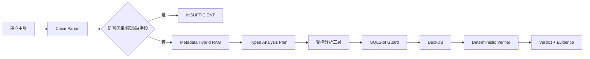
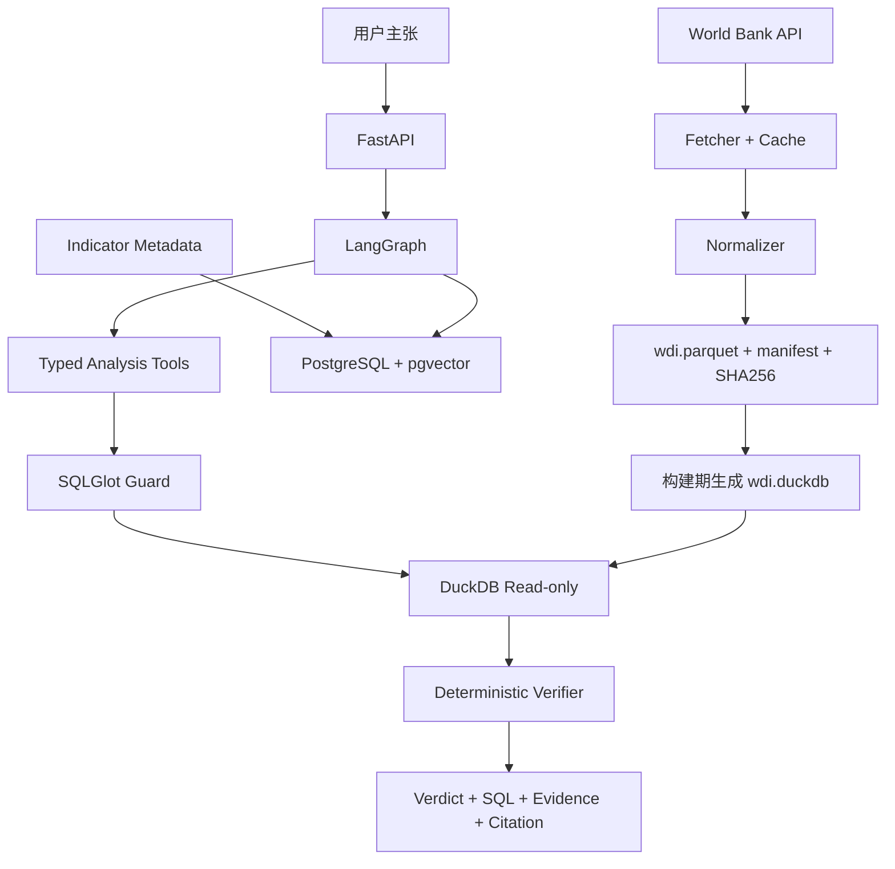

# WDI-ClaimCheck 三周项目规格书

副标题：基于 World Bank 发展指标的可复现事实核查 Agent

## 1. 项目一句话

用户输入一个关于国家发展指标的主张，系统检索正确的指标定义，调用受控分析工具在固定 World Bank 数据快照上完成精确计算，并返回：

- `SUPPORTED`
- `REFUTED`
- `INSUFFICIENT`

同时输出指标代码、国家、年份、单位、SQL、参与计算的数据行、指标来源、快照 SHA256 和局限说明。

示例：

> 2022 年中国人均 GDP 是否超过日本的 70%？

系统不能直接凭模型知识回答，必须先选择 `NY.GDP.PCAP.CD`，再查询固定快照，最后由确定性校验器比较数值。

## 2. 数据为什么容易获取

World Bank 官方 Indicators API v2：

- 无需 API Key 或其他认证。
- 支持 JSON 和分页。
- 提供指标名称、定义、来源和国家信息；部分指标的 API `unit` 字段可能为空，因此单位不能盲目信任接口。
- 可按国家、指标和年份请求。

官方资料：

- [Indicators API 说明](https://datahelpdesk.worldbank.org/knowledgebase/articles/889392)
- [API Basic Call Structures](https://datahelpdesk.worldbank.org/knowledgebase/articles/898581-api-basic-call-structures)
- [World Bank 数据使用条款](https://data.worldbank.org/summary-terms-of-use)

演示和评测不实时依赖 API：

1. 首次下载原始 JSON。
2. 保存请求 URL 和返回 hash。
3. 标准化为 Parquet。
4. 生成 `manifest.json` 和 SHA256。
5. Docker 演示只读固定快照。

## 3. 为什么不是普通 Text-to-SQL

- 不向量化数万条数值记录。
- RAG 只检索指标定义、单位、来源、国家别名和分析 recipe。
- LLM 不直接心算数值。
- LLM 不自由生成可执行 SQL。
- Agent 只选择 5 个受控分析工具。
- SQL 由确定性模板生成。
- DuckDB 精确查询 Parquet。
- Verifier 再计算比较关系并决定 verdict。
- 因果、预测、缺失数据和定义不清的问题必须拒答。

## 4. 三周 MVP 边界

### P0 必须完成

- 单一数据源：World Bank **World Development Indicators，固定 `source=2`**。
- 固定 8 个经过人工核验的指标。
- 年份：2000–2023。
- 真实国家/经济体。
- 允许 `WLD` 作为“世界”比较对象。
- 排名时排除 World、收入组和区域聚合。
- 5 种分析：lookup、compare、trend、growth、rank。
- 固定 Parquet 快照。
- Metadata Hybrid RAG。
- LangGraph 有限状态 Agent。
- 参数化 SQL 工具。
- DuckDB 只读查询。
- SQLGlot AST 二次校验。
- 确定性 verdict。
- FastAPI 同步接口。
- PostgreSQL + pgvector。
- Docker Compose。
- 35 道 benchmark：8 dev + 27 locked test。
- 20 道安全/越界测试。
- pytest、GitHub Actions、Locust。

### P1 有余力再做

- 扩展为 12 个指标、55 道 benchmark：10 dev + 45 locked test。
- 一个简单 HTML 结果页。
- 返回 Plotly 图表 JSON。
- 中英文双语解释。
- Redis/RQ 后台任务。

### 明确不做

- 不接入 OWID、Kaggle、新闻、天气等第二数据源。
- 不预测未来。
- 不做因果推断。
- 不支持任意指标和任意数据上传。
- 不让 LLM 执行 Python。
- 不允许用户传入原始 SQL。
- 不开发复杂 BI 面板或 React。
- 不做实时更新。
- 不做多轮长期记忆。

## 5. 指标配置

P0 固定 8 个指标。每个指标除了代码和名称，还必须手工审定单位、尺度、允许的运算和许可信息。不能仅依赖 API 的 `unit` 字段。

```yaml
SP.POP.TOTL:
  name: Population, total
  category: population
  canonical_unit: people
  scale: 1
  value_kind: count
  allowed_operations: [lookup, compare, trend, growth, rank]
  unit_source_url: "<actual-official-url>"
  license_url: "<actual-license-or-terms-url>"
  redistribution_allowed: null

NY.GDP.MKTP.CD:
  name: GDP, current US$
  category: economy
  canonical_unit: current_USD
  scale: 1
  value_kind: currency_current
  allowed_operations: [lookup, compare, trend, growth, rank]
  unit_source_url: "<actual-official-url>"
  license_url: "<actual-license-or-terms-url>"
  redistribution_allowed: null

NY.GDP.PCAP.CD:
  name: GDP per capita, current US$
  category: economy
  canonical_unit: current_USD_per_person
  scale: 1
  value_kind: currency_current_per_capita
  allowed_operations: [lookup, compare, trend, growth, rank]
  unit_source_url: "<actual-official-url>"
  license_url: "<actual-license-or-terms-url>"
  redistribution_allowed: null

NY.GDP.MKTP.KD.ZG:
  name: GDP growth, annual %
  category: economy
  canonical_unit: percent
  scale: 1
  value_kind: rate
  allowed_operations: [lookup, compare, trend, rank]
  unit_source_url: "<actual-official-url>"
  license_url: "<actual-license-or-terms-url>"
  redistribution_allowed: null

SP.DYN.LE00.IN:
  name: Life expectancy at birth
  category: health
  canonical_unit: years
  scale: 1
  value_kind: duration
  allowed_operations: [lookup, compare, trend, growth, rank]
  unit_source_url: "<actual-official-url>"
  license_url: "<actual-license-or-terms-url>"
  redistribution_allowed: null

IT.NET.USER.ZS:
  name: Individuals using the Internet, %
  category: technology
  canonical_unit: percent_of_population
  scale: 1
  value_kind: share
  allowed_operations: [lookup, compare, trend, growth, rank]
  unit_source_url: "<actual-official-url>"
  license_url: "<actual-license-or-terms-url>"
  redistribution_allowed: null

EG.ELC.ACCS.ZS:
  name: Access to electricity, %
  category: infrastructure
  canonical_unit: percent_of_population
  scale: 1
  value_kind: share
  allowed_operations: [lookup, compare, trend, growth, rank]
  unit_source_url: "<actual-official-url>"
  license_url: "<actual-license-or-terms-url>"
  redistribution_allowed: null

SP.URB.TOTL.IN.ZS:
  name: Urban population, %
  category: population
  canonical_unit: percent_of_population
  scale: 1
  value_kind: share
  allowed_operations: [lookup, compare, trend, growth, rank]
  unit_source_url: "<actual-official-url>"
  license_url: "<actual-license-or-terms-url>"
  redistribution_allowed: null
```

P1 候选 4 个指标：

```yaml
SL.UEM.TOTL.ZS:
  name: Unemployment, %
  category: labor
SH.XPD.CHEX.GD.ZS:
  name: Current health expenditure, % GDP
  category: health
NE.EXP.GNFS.ZS:
  name: Exports of goods and services, % GDP
  category: trade
NE.IMP.GNFS.ZS:
  name: Imports of goods and services, % GDP
  category: trade
```

下载后必须生成缺失率报告。

扩展规则：

- P0 的 8 个指标若缺失率明显过高，可以通过 `DECISIONS.md` 和新版 SPEC 替换，但指标数量固定为 8。
- 只有 P0 全部通过后才加入 P1 的 4 个候选。
- 不为了凑 12 个指标构造没有数据的测试题。
- `redistribution_allowed` 在人工核验前保持 `null`，构建流程必须 fail closed。

## 6. 数据快照

### 6.1 下载

每个指标独立请求，并强制包含：

```text
source=2
date=2000:2023
format=json
page=<n>
per_page=<configured>
```

构建前先请求并保存 World Bank source metadata，校验 `source_id=2` 且名称为 World Development Indicators。指标 metadata 也必须来自 source 2；若来源不匹配，构建立即失败。

下载器加入：

- 超时。
- 最多 3 次重试。
- 指数退避。
- 原始响应缓存。
- 页数校验。
- 请求 URL 记录。

同时下载：

- 指标 metadata。
- 国家/经济体 metadata。

### 6.2 国家过滤

国家接口包含真实国家、区域和收入组等聚合实体。

规则：

- `region.id != "NA"`：真实国家/经济体。
- 额外白名单 `WLD`：允许“世界”对比。
- ranking 工具永远排除 `WLD` 和所有聚合实体。

### 6.3 标准化表

`wdi.parquet`：

```text
country_code
country_name
indicator_code
indicator_name
year
value
api_unit_raw
canonical_unit
scale
source_id
source_name
is_aggregate
snapshot_id
```

`canonical_unit` 和 `scale` 来自人工审定的 `indicators.yaml`；`api_unit_raw` 仅用于审计，即使为空也不能覆盖配置值。

快照构建阶段同时把 Parquet 导入 `wdi.duckdb` 的实体表 `wdi` 并创建所需索引。运行时只读打开这个预建数据库，不能在请求过程中临时创建 view 或读取任意 Parquet 路径。

### 6.4 Manifest

```json
{
  "snapshot_id": "wdi-20260730-v1",
  "created_at_utc": "...",
  "year_start": 2000,
  "year_end": 2023,
  "source_id": 2,
  "source_name": "World Development Indicators",
  "indicator_codes": [],
  "request_urls": [],
  "raw_files": [
    {
      "path": "raw/NY.GDP.PCAP.CD.json",
      "sha256": "..."
    }
  ],
  "parquet_path": "snapshot/wdi.parquet",
  "parquet_sha256": "...",
  "duckdb_path": "snapshot/wdi.duckdb",
  "duckdb_sha256": "...",
  "row_count": 0,
  "country_count": 0,
  "missingness": {},
  "indicator_rights": [
    {
      "indicator_code": "SP.POP.TOTL",
      "provider": "<actual-provider>",
      "license_url": "<actual-url>",
      "attribution_text": "<actual-required-attribution>",
      "third_party_restrictions": "<actual-or-none>",
      "reviewed_at_utc": "<timestamp>",
      "redistribution_allowed": false
    }
  ],
  "snapshot_redistributable": false
}
```

发布规则必须 fail closed：

- 只有全部入选指标都完成人工许可核验且 `redistribution_allowed=true`，才可把 Parquet/DuckDB 快照放 GitHub Release，并附归属文本。
- 任一指标为 `false` 或 `null` 时，只发布下载/构建脚本、配置、manifest schema 和本地构建后得到的 hash，不上传原始 JSON、Parquet 或 DuckDB 数据。
- 项目代码的开源许可证不能替代数据许可证。
- README 必须链接 World Bank 使用条款，并提醒第三方指标例外。

## 7. Schema RAG

### 7.1 Metadata cards

每个指标生成一张 card：

```json
{
  "indicator_code": "NY.GDP.PCAP.CD",
  "name": "GDP per capita (current US$)",
  "definition": "...",
  "canonical_unit": "current_USD_per_person",
  "scale": 1,
  "api_unit_raw": "",
  "source_name": "...",
  "source_url": "...",
  "license_url": "...",
  "redistribution_allowed": "<actual-boolean-after-review>",
  "aliases_zh": ["人均GDP", "人均国内生产总值"],
  "aliases_en": ["GDP per capita"],
  "supported_intents": ["lookup", "compare", "trend", "rank"]
}
```

另外生成：

- 国家中英文别名 card。
- 5 类计算 recipe card。
- 拒答规则 card。

### 7.2 检索

- PostgreSQL full-text search top-5。
- pgvector dense top-5。
- Python RRF。
- top-3 metadata cards 进入 Agent。

Embedding：

```text
intfloat/multilingual-e5-small
```

严格使用模型要求的前缀：

```text
query: <用户指标查询>
passage: <metadata card>
```

不需要 HNSW；metadata 数量很小，exact cosine 足够。

### 7.3 检索目标

用户问：

> 互联网普及率

应检索：

```text
IT.NET.USER.ZS
```

用户问：

> 名义人均 GDP

应优先：

```text
NY.GDP.PCAP.CD
```

不能混成实际 GDP 增长率。

## 8. Agent 设计

### 8.1 状态

```python
class ClaimState(TypedDict):
    claim_id: str
    raw_claim: str
    claim_spec: dict | None
    retrieved_metadata: list[dict]
    analysis_plan: dict | None
    tool_name: str | None
    tool_args: dict | None
    generated_sql: str | None
    evidence_rows: list[dict]
    deterministic_verdict: str | None
    final_response: dict | None
    validation_errors: list[str]
    agent_steps: int
```

### 8.2 ClaimSpec

不能用一个大量可空字段的模型覆盖全部题型。使用 `operation` 作为 discriminator：

```text
ClaimSpec =
  LookupSpec
  | CompareSpec
  | TrendSpec
  | GrowthSpec
  | RankSpec
```

共同字段：

```text
operation
indicator_query
indicator_code
causal_language
forecast_language
original_claim
```

各子类型：

```text
LookupSpec:
  country, year, operator, threshold

CompareSpec:
  countries[2], year, comparison_mode
  comparison_mode = absolute | ratio | percent_difference
  operator, threshold

TrendSpec:
  country, start_year, end_year, trend_relation
  trend_relation =
    end_gt_start | end_lt_start |
    monotonic_non_decreasing | monotonic_non_increasing

GrowthSpec:
  country, start_year, end_year, growth_mode, operator, threshold
  growth_mode = absolute_change | percent_change | ratio

RankSpec:
  year, direction, limit, target_country?
  direction = top | bottom
  tie_policy = competition_rank
```

语义约束：

- “增长了多少”必须明确 absolute、percent 或 ratio；无法确定就 `INSUFFICIENT`。
- “总体上升”不能擅自解释为端点更高；必须映射到明确的 `trend_relation`，否则拒答。
- 已经是百分比的指标与“百分比变化”不是同一概念，Verifier 必须区分百分点变化和相对百分比变化。
- 所有字段先经 Pydantic 和白名单校验，再进入工具。

### 8.3 五个工具

```text
lookup(country, indicator, year)
compare(countries, indicator, year)
trend(country, indicator, start_year, end_year, trend_relation)
growth(country, indicator, start_year, end_year, growth_mode)
rank(indicator, year, direction, limit, tie_policy="competition_rank")
```

LLM 只能选择工具和参数，不能提交原始 SQL。

`rank` 结果必须额外返回：

- `eligible_economy_count`：进入该指标/年份排名范围的非聚合经济体数。
- `non_null_count` 与 `missing_count`。
- `tie_policy` 和并列名次。
- 实际 cutoff；若第 k 名并列，明确是否返回全部并列项。

报告只能写“在该快照中有数据的 N 个经济体中排名第 k”，不能无条件写“全球第 k”。

### 8.4 流程



### 8.5 Agent 限制

- 最多 6 个节点。
- 最多 2 次 metadata 检索。
- 最多 1 次工具执行重试。
- 不允许循环改写 SQL。
- 总超时 30–45 秒。
- LLM 只生成结构化 plan 和文字解释。
- verdict 必须由 verifier 决定。

## 9. SQL 安全

首选设计是参数化工具自行生成 SQL，而不是执行 LLM SQL。

SQLGlot 仍做二次校验：

- 只允许单条 `SELECT`。
- 只允许表/视图 `wdi`。
- 拒绝 DDL/DML。
- 拒绝 `COPY`、`ATTACH`、`INSTALL`、`LOAD`。
- 拒绝文件读取函数。
- 拒绝网络扩展。
- 最大返回 100 行。
- 查询超时。

运行时 DuckDB 约束：

- 只读打开快照构建阶段生成的 `wdi.duckdb`，只允许查询实体表 `wdi`。
- 容器以非 root 用户运行，只把快照目录只读挂载，不挂载宿主机其他目录。
- 在锁定的 DuckDB 版本上关闭 external access、扩展自动安装和自动加载；启动测试必须验证这些配置实际生效。
- 不允许运行时调用 `read_parquet`、`read_csv`、`ATTACH`、URL/S3 读取或安装社区扩展。
- SQLGlot、参数白名单、DuckDB 配置和容器文件权限是四层约束，不能只宣传“read_only=true”。

20 个安全测试至少包括：

- `DROP TABLE`。
- `DELETE`。
- `UPDATE`。
- `COPY TO`。
- `read_csv('/etc/passwd')`。
- `ATTACH`。
- `INSTALL httpfs`。
- 超大 `CROSS JOIN`。
- 多语句。
- 注释绕过。

由于用户无法直接提交 SQL，这些测试主要验证内部 guard 和未来扩展不会突破边界。

## 10. Deterministic Verifier

Verifier 检查：

- indicator code 与 metadata 一致。
- 国家代码存在。
- 年份在快照范围。
- 所需数据点是否缺失。
- 单位是否一致。
- compare/growth/rank 的计算是否可重复。
- claim 中的阈值和操作符。
- causal language。

Verdict：

- `SUPPORTED`：数据满足主张。
- `REFUTED`：数据与主张相反。
- `INSUFFICIENT`：缺数据、定义不清、预测、因果或超出范围。

LLM 不得覆盖 verifier 的 verdict。

## 11. 整体架构



## 12. 目录

```text
wdi-claimcheck/
├─ app/
│  ├─ main.py
│  ├─ api/
│  │  ├─ claims.py
│  │  ├─ datasets.py
│  │  ├─ indicators.py
│  │  └─ health.py
│  ├─ core/
│  │  ├─ config.py
│  │  ├─ logging.py
│  │  └─ llm.py
│  ├─ agent/
│  │  ├─ state.py
│  │  ├─ schemas.py
│  │  ├─ nodes.py
│  │  └─ graph.py
│  ├─ retrieval/
│  │  ├─ cards.py
│  │  ├─ lexical.py
│  │  ├─ dense.py
│  │  └─ fusion.py
│  ├─ tools/
│  │  ├─ lookup.py
│  │  ├─ compare.py
│  │  ├─ trend.py
│  │  ├─ growth.py
│  │  ├─ rank.py
│  │  ├─ sql_guard.py
│  │  └─ verifier.py
│  ├─ storage/
│  │  ├─ postgres.py
│  │  └─ duckdb_store.py
│  └─ domain/
│     ├─ claim.py
│     └─ evidence.py
├─ config/
│  └─ indicators.yaml
├─ scripts/
│  ├─ fetch_wdi.py
│  ├─ build_snapshot.py
│  ├─ build_metadata_index.py
│  └─ summarize_snapshot.py
├─ data/
│  ├─ raw/
│  ├─ snapshot/
│  └─ manifests/
├─ benchmarks/
│  ├─ dev.jsonl
│  ├─ locked_test.jsonl
│  └─ eval_lock.json
├─ eval/
│  ├─ generate_cases.py
│  ├─ run_eval.py
│  ├─ metrics.py
│  └─ ablation.py
├─ tests/
│  ├─ unit/
│  ├─ integration/
│  ├─ security/
│  └─ api/
├─ reports/
├─ Dockerfile
├─ compose.yaml
├─ pyproject.toml
├─ .env.example
├─ SPEC.md
├─ AGENTS.md
└─ README.md
```

## 13. API

### `POST /api/v1/claims/verify`

请求：

```json
{
  "claim": "2022 年中国人均 GDP 是否超过日本的 70%？",
  "language": "zh-CN"
}
```

MVP 同步返回。

### `GET /api/v1/datasets/current`

返回：

- snapshot ID。
- SHA256。
- 行数。
- 国家数。
- 指标数。
- 年份。
- 各指标缺失率。

### `GET /api/v1/indicators`

P0 返回固定 8 个支持指标及定义；只有 P1 SPEC 明确启用后才可返回 12 个。

### `POST /api/v1/indicators/search`

调试和演示 metadata retrieval。

### `GET /health/live`

API 进程状态。

### `GET /health/ready`

检查当前配置的 metadata backend、预建只读 `wdi.duckdb`、snapshot/manifest hash 和 `source_id=2`。正式 profile 使用 PostgreSQL/pgvector；如果已通过新版 SPEC 切换本地索引，readiness 必须检查实际 backend，不能硬编码 pgvector。

### 输出

```json
{
  "claim_id": "uuid",
  "verdict": "SUPPORTED",
  "normalized_claim": {},
  "indicator_codes": ["NY.GDP.PCAP.CD"],
  "tool": "compare",
  "tool_args": {},
  "sql": "SELECT ...",
  "evidence_rows": [],
  "calculation": {},
  "citations": [],
  "snapshot_sha256": "...",
  "timings_ms": {
    "parse": 0,
    "retrieve": 0,
    "query": 0,
    "verify": 0,
    "llm": 0,
    "total": 0
  },
  "limitations": []
}
```

## 14. 35 道 P0 评测

划分：

- dev：8。
- locked test：27。

题型：

- lookup：6。
- compare：8。
- trend：5。
- growth：5。
- rank：4。
- 缺失/定义含糊：4。
- 聚合实体、未来、因果、单位混淆：3。

每题：

```json
{
  "id": "claim_001",
  "claim": "...",
  "snapshot_sha256": "...",
  "gold_country_codes": ["CHN"],
  "gold_indicator_codes": ["NY.GDP.PCAP.CD"],
  "gold_years": [2022],
  "gold_tool": "compare",
  "gold_tool_args": {},
  "gold_query_spec": {},
  "gold_evidence_rows": [],
  "gold_result": {
    "result_type": "ratio",
    "value": 0.0,
    "eligible_economy_count": null,
    "missing_count": null,
    "tie_policy": null
  },
  "tolerance": 0.01,
  "gold_verdict": "SUPPORTED",
  "required_citations": []
}
```

构建：

1. 用独立的 benchmark generator 生成 25 个候选结构化问题，再转成自然语言。
2. 人工编写 10 个非模板边界/拒答案例。
3. 按 `template_family_id` 分组切分；同一个生成模板及其改写不得同时出现在 dev 和 locked。
4. 8 条 dev 只来自明确标记的开发模板；27 条 locked 由 17 条未见模板题和全部 10 条人工边界题构成。
5. 在 `eval/reference/` 实现独立 reference evaluator；它不得 import `app/tools`、Agent、SQL 模板或 Verifier。
6. reference evaluator 直接读取固定数据，使用独立的 Decimal/序列/排名逻辑计算 evidence、结果和 verdict。
7. 人工核对全部 35 题的语义、单位、证据行和 reference 结果。
8. 生成 `eval_lock.json`，记录题目、gold、reference evaluator commit 和 snapshot SHA256。

锁定后不得继续用 27 题调 prompt、规则、工具或 Verifier。最终只运行一次并记录失败；如果根据 locked failure 修改行为，必须创建新的未见 holdout 版本后才能报告新成绩。

P1 扩展为 55 题时，使用相同规则增加 20 条新的未见模板/人工题，形成 10 dev +45 locked；不能简单复制原题换国家或年份。

## 15. 指标

### Metadata RAG

- Indicator Recall@1。
- Indicator Recall@3。
- MRR@3。

### Claim 解析

- Country Resolution Accuracy。
- Intent Accuracy。
- Year/Operator/Threshold Accuracy。

### 工具与数值

- Tool Selection Accuracy。
- SQL Execution Success Rate。
- Numeric Result Accuracy。
- Relative/absolute tolerance pass rate。

### Verdict

- Macro-F1。
- End-to-end Correct Rate。
- `INSUFFICIENT` Precision/Recall/F1。

### 证据

- Citation Completeness。
- Snapshot Hash Presence。
- Evidence Row Completeness。

### 效率

- 平均模型调用数。
- token。
- p50/p95。
- 失败率。

## 16. 消融

只做三到四组：

1. 直接 LLM 选择指标和工具。
2. BM25 metadata → typed tool。
3. BM25 + dense + RRF → typed tool。
4. Hybrid RAG + typed plan + verifier。

不要为了消融引入新的模型或数据库。

## 17. 性能测试

分开报告：

### 无 LLM 工具链

- metadata retrieval。
- DuckDB query。
- verifier。
- 运行 100–500 次。

目标：

- retrieval p95 < 300 ms。
- DuckDB query p95 < 200 ms。
- 无 LLM 工具链 p95 < 500 ms。

### FakeLLM

- 5/10 并发。
- 5 分钟。
- 验证 FastAPI、Postgres、DuckDB 和错误处理。

### 真实模型

- 1/3/5 并发。
- 每个并发档若完成请求数不少于 50，报告模型、网络、硬件、p50、p95、失败率和 token。
- 若任一档只有 10–49 个完成请求，只报告 median、min–max、失败率和样本量，不写 p95。

真实模型达到多少写多少，不把 FakeLLM 结果混用。

## 18. 15 个工作日

### 第 1 周

- Day 1：仓库、discriminated schema、8 指标 YAML 和许可字段。
- Day 2：固定 `source=2` 的 World Bank 分页、重试、缓存。
- Day 3：过滤实体、Parquet、预建 DuckDB、manifest、缺失率。
- Day 4：独立 reference evaluator、DuckDB 五类工具。
- Day 5：8 道 dev 和首批 7 道 locked 候选，完成确定性基线。

### 第 2 周

- Day 6：metadata cards、国家别名、recipe、e5 前缀。
- Day 7：BM25 + pgvector + RRF，增加未见模板候选题。
- Day 8：ClaimSpec、AnalysisPlan，增加人工边界题。
- Day 9：LangGraph、typed tools、SQL guard，完成安全测试主体。
- Day 10：Verifier、verdict、拒答，独立复算候选 gold。

### 第 3 周

- Day 11：FastAPI、OpenAPI、HTTPX，补齐 35 题候选。
- Day 12：Docker Compose、clean start、逐指标许可核验。
- Day 13：人工核对全部 35 题，冻结 27 条 locked 和 benchmark hash。
- Day 14：只运行一次 locked、消融、安全测试和 Locust；不得按 locked 个案修改行为。
- Day 15：CI、安全检查、README、条件式数据发布、Release、演示和真实简历数字。

## 19. 降级

| 风险 | 降级 |
|---|---|
| World Bank API 临时失败 | 使用已缓存 raw JSON 和固定 Parquet |
| P1 指标缺失严重 | 停留在 P0 的 8 个指标，不为凑 12 个构造题 |
| pgvector 调试耗时 | 通过 `DECISIONS.md` 和新版 SPEC 切换 BM25 + NumPy cosine；readiness、README 和简历只描述实际 backend |
| LLM 生成 plan 不稳定 | 只支持模板化 5 类意图 |
| LLM 生成 SQL 错误 | 不允许自由 SQL，只用参数化工具 |
| 模型太慢 | 外部 OpenAI-compatible endpoint；应用继续 Docker 化 |
| 前端来不及 | Swagger + curl |
| 工期不足 | 不开始 12 指标/55 题 P1；保留 8 指标/35 题 P0，先删网页和可视化 |

## 20. 简历模板

完成后用真实数字替换：

> **WDI-ClaimCheck：全球发展指标事实核查 Agent**  
> Python / FastAPI / LangGraph / `{actual_metadata_backend}` / DuckDB / Docker
>
> - 构建基于 World Bank WDI 固定快照的结构化事实核查 Agent，处理 `{row_count}` 条国家—年份—指标记录；通过 Metadata Hybrid RAG 选择指标定义，并由 DuckDB 生成可复现数值证据。
> - 编排“主张解析—指标检索—typed analysis plan—参数化 SQL—确定性校验—证据报告”流程，使用 SQLGlot 白名单和拒答策略约束危险或不可回答请求；在 `{actual_locked_case_count}` 条锁定测试上取得 Indicator Recall@3 `{x}`、数值准确率 `{y}`、Verdict Macro-F1 `{z}`。
> - 使用 FastAPI、`{actual_metadata_backend}` 与 Docker Compose 部署；在 `{hardware}` 上完成 `{actual_completed_requests}` 次、并发 `{concurrency}` 的真实模型测试，报告 `{latency_stat_with_sample_size}` 和错误率 `{error_rate}`，所有结果关联快照 SHA256 和 World Bank `source=2` metadata。

## 21. 面试必须能解释

- 为什么只向量化 metadata，不向量化数值记录？
- 为什么 DuckDB 比让 LLM 直接回答更可靠？
- 如何处理“世界”与真实国家的区别？
- nominal GDP 和 GDP growth 为什么不能混用？
- 为什么 LLM 不负责最终 verdict？
- 为什么 gold 必须由不 import 被测工具的 reference evaluator 独立复算？
- 为什么不允许自由 SQL？
- SQLGlot 在参数化工具之后还有什么价值？
- World Bank 数据更新后如何保证旧评测可复现？
- 为什么真实模型压测和 FakeLLM 压测要分开？
