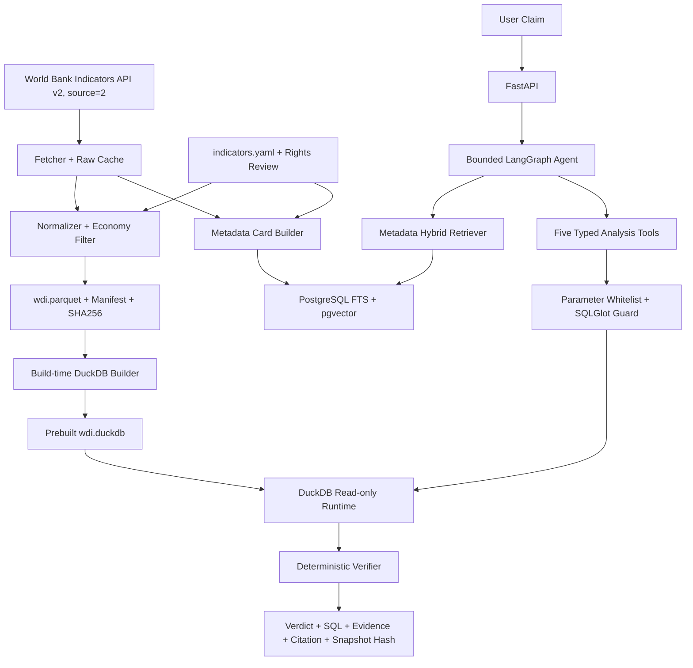
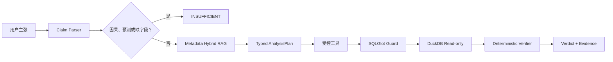

# WDI-ClaimCheck 项目说明与每日开发计划

更新时间：2026-08-06
项目状态：`planned`
启动条件：MigrationLens 通过工程发布门槛后的下一个工作日

## 1. 项目概述

### 1.1 一句话介绍

用户输入一个关于国家发展指标的主张，WDI-ClaimCheck 检索正确的指标定义，在固定的
World Bank World Development Indicators 快照上调用受控分析工具完成精确计算，
再由确定性 Verifier 返回 `SUPPORTED`、`REFUTED` 或 `INSUFFICIENT`，同时输出
指标、国家、年份、单位、SQL、证据行、来源和快照 SHA256。

### 1.2 目标用户与事实核查场景

- 需要核验公开发展指标主张的研究者、记者、分析师和学生；
- 需要将自然语言问题转换为可复现数据查询的应用开发者；
- 需要区分“数据支持”“数据反驳”“证据不足”的审核人员。

示例：

> 2022 年中国人均 GDP 是否超过日本的 70%？

系统不能凭模型记忆回答。它必须选择 `NY.GDP.PCAP.CD`，在固定 `source=2`
快照中读取数据，按明确 ratio 计算，再由 Verifier 决定 verdict。

### 1.3 为什么不是预测、因果或普通 Text-to-SQL

- P0 只核查快照内的描述性事实，不预测未来，不做因果推断；
- RAG 只检索指标定义、单位、来源、国家别名和分析 recipe；
- 数万条数值记录不进入向量库；
- LLM 不心算数值，不决定最终 verdict；
- LLM 不能提交自由 SQL 或 Python；
- 五类工具根据白名单参数生成参数化 SQL；
- DuckDB 精确查询固定快照；
- Verifier 独立复算关系；
- 缺失、定义不清、因果、预测和范围外问题必须 `INSUFFICIENT`。

### 1.4 与 MigrationLens 的技术差异

MigrationLens 的确定性核心是 AST 规则和一跳 import，RAG 对象是官方迁移文档；
WDI 的确定性核心是 DuckDB 工具和 Verifier，RAG 对象是 metadata cards。前者防止
误报和伪造引用，后者防止指标混淆、自由 SQL、模型心算和不受支持结论。

官方资料：

- [World Bank Indicators API](https://datahelpdesk.worldbank.org/knowledgebase/articles/889392)
- [API Basic Call Structures](https://datahelpdesk.worldbank.org/knowledgebase/articles/898581-api-basic-call-structures)
- [World Bank 数据使用条款](https://data.worldbank.org/summary-terms-of-use)

## 2. 当前状态

- WDI-ClaimCheck 当前尚未开始业务实现；
- 当前仓库的 `app/`、`tests/`、SQLite、FastAPI 和 FakeLLM 都属于 MigrationLens；
- WDI 现阶段只有本计划，不存在 WDI 数据快照、代码、测试、Docker、CI 或实测指标；
- MigrationLens 的 34 个当前测试、历史 15/16/25 个测试和任何 Docker 结果都不能
  作为 WDI 证据；
- WDI 可以复用已验证的工程模式和学习经验，但必须在自己的实现、测试、commit、
  快照和报告中重新提供证据。

WDI 将在未来使用独立仓库 `wdi-claim-check`，并拥有自己的 `SPEC.md`、
`AGENTS.md`、`TASKS.md`、`DECISIONS.md`、`README.md`、`app/` 和 `tests/`。
当前 `PyMigrate-Agent` 仓库只保存 WDI 的规划文档；本计划不授权现在创建 WDI
仓库、业务代码、测试、数据或部署文件。

所有 WDI Day 均为 `planned`。只有 MigrationLens 的工程发布门槛已经用真实
CI、clean clone、Docker、README 和发布证据通过，且用户明确批准启动未来独立
仓库后，才可执行 WDI Day 1。最终双项目简历、统一演示和面试材料属于后续作品集
整合门槛，不应与这里的 MigrationLens 工程启动门槛混淆。

## 3. P0、P1、Lite 和明确不做

### 3.1 P0 必须完成

- 单一数据源：World Bank World Development Indicators，固定 `source=2`；
- 8 个经人工核验的指标；
- 年份 2000–2023；
- 真实国家/经济体；
- `WLD` 只作为“世界”比较对象；
- rank 排除 World、区域和收入组聚合；
- lookup、compare、trend、growth、rank 五种分析；
- 固定 Parquet 快照；
- 构建期生成并在运行期只读打开 `wdi.duckdb`；
- Metadata Hybrid RAG；
- LangGraph 有限状态 Agent；
- 参数化 SQL 工具；
- SQLGlot AST 二次校验；
- 确定性 Verifier；
- FastAPI 同步接口；
- PostgreSQL + pgvector metadata backend；
- Docker Compose；
- 35 道 benchmark：8 dev、27 locked；
- 20 道安全/越界测试；
- pytest、GitHub Actions、Locust。

### 3.2 P1

- 扩展为 12 个指标、55 道 benchmark：10 dev、45 locked；
- 简单 HTML 结果页；
- Plotly 图表 JSON；
- 中英文双语解释；
- Redis/RQ 后台任务候选。

P1 只有在 P0 v1.0 发布且未来 SPEC/仓库治理允许后才能开始。当前仓库明确禁止引入
Redis/Celery 类基础设施，因此本计划只保留历史 P1 候选，不授权实施。

### 3.3 WDI Lite

Lite 不是当前批准范围。只有工期不足且先追加决策、发布新版 WDI SPEC 和更新验收后
才可启用。Lite 仍必须保留：

- 8 指标、35 题和 20 安全测试；
- FastAPI、LangGraph、受控工具、Docker；
- 固定本地快照、hash、许可记录；
- 独立 reference evaluator；
- dev/locked 隔离和所有证据边界。

允许的变化只有：

- metadata backend 从 PostgreSQL/pgvector 改为 BM25 + 本地 dense；
- 删除网页、P1、快照数据上传和真实模型高并发。

README、readiness、评测元数据和简历必须写 Lite 的实际架构。

### 3.4 明确不做

- 不接入 OWID、Kaggle、新闻、天气等第二数据源；
- 不预测未来；
- 不做因果推断；
- 不支持任意指标或任意数据上传；
- 不让 LLM 执行 Python；
- 不允许用户或 LLM 提交原始 SQL；
- 不开发复杂 BI 面板或 React；
- 不做实时更新；
- 不做多轮长期记忆；
- 不用模型训练或微调；
- 不用多 Agent。

### 3.5 固定指标

P0 的 `canonical_unit`、`scale`、`value_kind` 和允许操作是机器契约，必须人工
审定，不能盲信 API 可能为空的 `unit` 字段，也不能把下表中的枚举改写为带空格的
展示文本。

| 指标代码 | 名称 | `canonical_unit` | `scale` | `value_kind` | 允许操作 |
|---|---|---|---:|---|---|
| `SP.POP.TOTL` | Population, total | `people` | 1 | `count` | lookup, compare, trend, growth, rank |
| `NY.GDP.MKTP.CD` | GDP, current US$ | `current_USD` | 1 | `currency_current` | lookup, compare, trend, growth, rank |
| `NY.GDP.PCAP.CD` | GDP per capita, current US$ | `current_USD_per_person` | 1 | `currency_current_per_capita` | lookup, compare, trend, growth, rank |
| `NY.GDP.MKTP.KD.ZG` | GDP growth, annual % | `percent` | 1 | `rate` | lookup, compare, trend, rank |
| `SP.DYN.LE00.IN` | Life expectancy at birth | `years` | 1 | `duration` | lookup, compare, trend, growth, rank |
| `IT.NET.USER.ZS` | Individuals using the Internet, % | `percent_of_population` | 1 | `share` | lookup, compare, trend, growth, rank |
| `EG.ELC.ACCS.ZS` | Access to electricity, % | `percent_of_population` | 1 | `share` | lookup, compare, trend, growth, rank |
| `SP.URB.TOTL.IN.ZS` | Urban population, % | `percent_of_population` | 1 | `share` | lookup, compare, trend, growth, rank |

每个配置还必须有 `unit_source_url`、`provider`、`license_url`、
`attribution_text`、第三方限制和 `redistribution_allowed`。在人工核验前，
`redistribution_allowed=null`，发布流程 fail closed。

P1 候选完整记录如下：

| 指标代码 | 名称 | 类别 |
|---|---|---|
| `SL.UEM.TOTL.ZS` | Unemployment, % | labor |
| `SH.XPD.CHEX.GD.ZS` | Current health expenditure, % GDP | health |
| `NE.EXP.GNFS.ZS` | Exports of goods and services, % GDP | trade |
| `NE.IMP.GNFS.ZS` | Imports of goods and services, % GDP | trade |

如果 P0 指标缺失率严重，只能先在未来 WDI 仓库的 `DECISIONS.md` 追加决策、
发布新版 `SPEC.md` 并更新验收测试后替换；P0 指标数量仍固定为 8。只有 P0
全部通过发布门槛后才可加入 P1 指标，不能为了凑 12 个指标构造无数据题。

## 4. 数据方案

### 4.1 下载边界

所有数据请求强制：

```text
source=2
date=2000:2023
format=json
page=<n>
per_page=<configured>
```

构建前先保存并验证 source metadata：`source_id=2` 且名称为
World Development Indicators。指标 metadata 也必须属于 source 2；不匹配时
构建失败。

下载器必须有 timeout、最多三次重试、指数退避、原始响应缓存、页数/记录数校验和
请求 URL 记录，并同时获取指标和国家/经济体 metadata。下载失败不能生成成功
manifest，也不能替换为模拟数据。

### 4.2 国家与聚合实体

- `region.id != "NA"` 视为真实国家/经济体；
- `WLD` 额外加入比较白名单；
- rank 永远排除 `WLD` 和所有聚合实体；
- 报告只能写“在该快照中有数据的 N 个经济体中排名第 k”，不能无条件写
  “全球第 k”。

### 4.3 原始缓存、Parquet 和 DuckDB

演示和评测不实时依赖 API：

1. 首次下载原始 JSON 并保存 URL/hash；
2. 标准化为 `wdi.parquet`；
3. 构建期将 Parquet 导入实体表 `wdi`；
4. 创建所需索引并生成 `wdi.duckdb`；
5. 运行时只读打开预建数据库；
6. 不在请求中创建 view 或读取任意 Parquet/CSV/URL。

`wdi.parquet` 字段：

```text
country_code
country_name
indicator_code
indicator_name
year
value
api_unit_raw
canonical_unit
scale
source_id
source_name
is_aggregate
snapshot_id
```

`canonical_unit` 和 `scale` 来自人工配置；`api_unit_raw` 只用于审计。

### 4.4 Manifest 与许可

manifest 至少记录：

- snapshot ID、UTC 创建时间、2000–2023、`source_id=2` 和 source name；
- 8 个 indicator code；
- 全部请求 URL；
- 每个 raw 文件路径与 SHA256；
- Parquet/DuckDB 路径和 SHA256；
- 行数、国家数、缺失率；
- 每指标 provider、license URL、attribution、第三方限制、复核时间和
  `redistribution_allowed`；
- raw 再分发专项复核状态、复核时间和结论；默认状态为未批准；
- `snapshot_redistributable`。

发布规则 fail closed：

- 默认不授权 raw JSON 再分发；
- 只有全部指标都人工核验为 `redistribution_allowed=true`，并完成派生快照专项
  复核后，才可发布派生 Parquet/DuckDB，并附完整归属；
- raw JSON 即使对应指标全部为 `true`，仍须额外、明确的 raw 再分发专项复核；
  没有该复核结论时不得上传 raw；
- 任一指标为 `false` 或 `null` 时，只发布下载/构建脚本、配置、manifest schema
  和本地构建 hash，不发布 raw、Parquet 或 DuckDB；
- 项目代码许可证不能替代数据许可证；
- README 链接 World Bank 条款并提醒第三方指标例外。

### 4.5 完整构建与运行架构

构建期和请求运行期必须分离：



- 构建期可以访问固定 World Bank API，运行期不依赖现场网络；
- raw cache、Parquet 和 DuckDB 都由 manifest/hash 追踪；
- PostgreSQL/pgvector 只存 metadata cards，不存数值事实；
- 运行期 DuckDB 只打开预建实体表，不读取任意外部路径；
- LLM 只生成结构化 plan 和解释，不能生成可执行自由 SQL，也不能决定 verdict。

### 4.6 未来独立仓库建议目录

以下目录只描述未来 `wdi-claim-check` 仓库；当前文档任务不创建它们。

```text
wdi-claim-check/
├─ app/
│  ├─ main.py
│  ├─ api/
│  ├─ core/
│  ├─ agent/
│  ├─ retrieval/
│  ├─ tools/
│  ├─ storage/
│  └─ domain/
├─ config/
│  └─ indicators.yaml
├─ scripts/
│  ├─ fetch_wdi.py
│  ├─ build_snapshot.py
│  ├─ build_metadata_index.py
│  └─ summarize_snapshot.py
├─ data/
│  ├─ raw/
│  ├─ snapshot/
│  ├─ manifests/
│  └─ cards/
├─ benchmarks/
│  ├─ dev.jsonl
│  ├─ locked_test.jsonl
│  └─ eval_lock.json
├─ eval/
│  ├─ reference/
│  ├─ generate_cases.py
│  ├─ run_eval.py
│  ├─ metrics.py
│  └─ ablation.py
├─ tests/
│  ├─ unit/
│  ├─ integration/
│  ├─ security/
│  └─ api/
├─ reports/
├─ Dockerfile
├─ compose.yaml
├─ pyproject.toml
├─ .env.example
├─ SPEC.md
├─ AGENTS.md
├─ TASKS.md
├─ DECISIONS.md
├─ README.md
├─ LICENSE
└─ THIRD_PARTY_NOTICES.md
```

## 5. Schema RAG 和确定性工具

### 5.1 Metadata cards

每个指标 card 包含：

```text
indicator_code
name
definition
canonical_unit
scale
api_unit_raw
source_id
source_name
source_url
license_url
redistribution_allowed
aliases_zh
aliases_en
supported_operations
caveats
snapshot_hash
```

还要生成国家中英文别名、五类计算 recipe 和拒答规则 card。数值事实不进入向量库。

### 5.2 Hybrid metadata retrieval

- PostgreSQL full-text search top-5；
- pgvector dense top-5；
- Python RRF；
- top-3 metadata cards 进入 Agent；
- Embedding 使用 `intfloat/multilingual-e5-small`；
- query 严格使用 `query:`，card 严格使用 `passage:`；
- metadata 数量很小，不要求 HNSW，exact cosine 足够。

例如“互联网普及率”应检索 `IT.NET.USER.ZS`；“名义人均 GDP”应优先
`NY.GDP.PCAP.CD`，不能混成实际 GDP 增长率。

### 5.3 ClaimSpec 与 AnalysisPlan

`ClaimSpec` 使用 `operation` discriminator：

```text
LookupSpec
CompareSpec
TrendSpec
GrowthSpec
RankSpec
```

共同字段包括 operation、indicator query/code、causal/forecast language 和
original claim。专属字段：

- lookup：country、year、operator、threshold；
- compare：两个国家、year、absolute/ratio/percent-difference、operator、
  threshold；
- trend：country、start/end year、端点或 monotonic relation；
- growth：country、start/end year、absolute change/percent change/ratio；
- rank：year、top/bottom、limit、target country、competition-rank tie policy。

语义边界：

- “增长多少”必须明确 absolute、percent 或 ratio；
- “总体上升”不能擅自解释为端点更高；
- 百分比指标的百分点变化和相对百分比变化是不同运算；
- 字段必须先通过 Pydantic 与白名单校验；
- 无法确定则 `INSUFFICIENT`。

`AnalysisPlan` 只包含选择的工具、校验后参数、所需证据和拒答原因，不包含自由 SQL。

### 5.4 五个工具

```text
lookup(country, indicator, year)
compare(countries, indicator, year)
trend(country, indicator, start_year, end_year, trend_relation)
growth(country, indicator, start_year, end_year, growth_mode)
rank(indicator, year, direction, limit, tie_policy="competition_rank")
```

工具只接受白名单结构化参数并生成参数化 SQL。rank 额外返回
`eligible_economy_count`、`non_null_count`、`missing_count`、tie policy、
并列名次和实际 cutoff。

## 6. Agent、Verifier 和拒答

### 6.1 ClaimState

状态至少包含：

```text
claim_id
raw_claim
claim_spec
retrieved_metadata
analysis_plan
tool_name
tool_args
generated_sql
evidence_rows
deterministic_verdict
final_response
validation_errors
agent_steps
```

### 6.2 Agent 流程与限制



- 最多 6 个节点；
- 最多 2 次 metadata 检索；
- 最多 1 次工具执行重试；
- 不允许循环改写 SQL；
- 总 timeout 30–45 秒；
- LLM 只生成结构化 plan 和文字解释；
- Agent 不拥有 shell、Python、自由 SQL、写文件或任意网络工具。

### 6.3 Deterministic Verifier

Verifier 检查：

- indicator code 与 metadata；
- 国家代码与聚合边界；
- 年份和数据缺失；
- canonical unit、scale 和运算；
- compare/growth/rank 可重复计算；
- claim 阈值、operator；
- causal/forecast language；
- evidence row 和 snapshot hash 完整性。

Verdict：

- `SUPPORTED`：数据满足主张；
- `REFUTED`：数据与主张相反；
- `INSUFFICIENT`：缺数据、定义不清、预测、因果或超出范围。

LLM 不能覆盖 Verifier verdict。

### 6.4 operation-specific gold

每道 benchmark 的 gold 至少使用以下机器可读契约：

```json
{
  "id": "claim_001",
  "template_family_id": "compare_ratio_v1",
  "claim": "...",
  "snapshot_sha256": "...",
  "operation": "compare",
  "gold_country_codes": ["CHN", "JPN"],
  "gold_indicator_codes": ["NY.GDP.PCAP.CD"],
  "gold_years": [2022],
  "gold_tool": "compare",
  "gold_tool_args": {},
  "gold_query_spec": {},
  "gold_evidence_rows": [],
  "gold_result": {
    "result_type": "ratio",
    "value": 0.0,
    "eligible_economy_count": null,
    "missing_count": null,
    "tie_policy": null,
    "series": null
  },
  "tolerance": 0.01,
  "gold_verdict": "SUPPORTED",
  "allowed_insufficient_reasons": [],
  "required_citations": []
}
```

rank gold 需要 eligible/non-null/missing counts 和 ties，trend gold 需要完整 series；
每题都必须绑定原始 claim、template family、快照 hash、证据行、容差和引用要求。

gold 由 `eval/reference/` 中的独立 evaluator 直接读取固定数据，使用独立
Decimal、序列和排名逻辑计算；它不得 import 应用工具、SQL 模板、Agent 或
Verifier。

## 7. API、安全和评测

### 7.1 API

`POST /api/v1/claims/verify` 使用同步请求：

```json
{
  "claim": "2022 年中国人均 GDP 是否超过日本的 70%？",
  "language": "zh-CN"
}
```

P0 的 `language` 只接受 `zh-CN`；双语解释属于 P1。响应至少包含：

```json
{
  "claim_id": "uuid",
  "verdict": "SUPPORTED",
  "normalized_claim": {},
  "indicator_codes": ["NY.GDP.PCAP.CD"],
  "tool": "compare",
  "tool_args": {},
  "sql": "SELECT ...",
  "evidence_rows": [],
  "calculation": {},
  "citations": [],
  "snapshot_sha256": "...",
  "timings_ms": {
    "parse": 0,
    "retrieve": 0,
    "query": 0,
    "verify": 0,
    "llm": 0,
    "total": 0
  },
  "limitations": []
}
```

SQL 是受控工具模板生成并用于审计的证据，API 不接受用户或 LLM 原始 SQL。

其他端点：

- `GET /api/v1/datasets/current`：返回 snapshot ID/SHA256、行数、国家数、固定
  8 个指标数、2000–2023 年范围和逐指标缺失率；
- `GET /api/v1/indicators`：P0 只能返回固定 8 个指标及其定义；只有未来 P1
  SPEC 明确启用后才可返回 12 个；
- `POST /api/v1/indicators/search`：仅用于 metadata retrieval 调试和演示；
- `GET /health/live`：只检查 API 进程存活；
- `GET /health/ready`：检查实际 metadata backend、预建只读
  `wdi.duckdb`、manifest/hash 和 `source_id=2`。

经正式决策切换 backend 后，readiness 必须检查实际 backend，不能继续硬编码
pgvector。

### 7.2 SQL 与运行时安全

SQL 由参数化工具生成，SQLGlot 仍二次检查：

- 只允许单条 `SELECT`；
- 只允许实体表 `wdi`；
- 拒绝 DDL/DML、`COPY`、`ATTACH`、`INSTALL`、`LOAD`；
- 拒绝文件读取函数和网络 URI；
- 最大返回 100 行；
- 查询 timeout。

DuckDB 运行时：

- 只读打开预建数据库；
- 容器非 root；
- 快照目录只读挂载，不挂载其他宿主路径；
- 关闭 external access、扩展自动安装和自动加载；
- 不调用 `read_parquet`、`read_csv`、URL/S3 或社区扩展。

参数白名单、SQLGlot、DuckDB 配置和容器权限是四层约束，不能只宣传
`read_only=true`。

20 个安全/越界测试独立于 35 题事实准确率，至少覆盖 DROP、DELETE、UPDATE、
INSERT、COPY、ATTACH、INSTALL/LOAD、文件函数、多语句、注释绕过、大 CROSS JOIN、
路径穿越和超大 limit。

### 7.3 35 题 P0 benchmark

划分：

- 8 dev；
- 27 locked。

题型：

- lookup 6；
- compare 8；
- trend 5；
- growth 5；
- rank 4；
- 缺失/定义含糊 4；
- 聚合实体、未来、因果、单位混淆 3。

构建流程：

1. 独立 generator 生成 25 个候选结构化问题并转自然语言；
2. 人工编写 10 个非模板边界/拒答案例；
3. 按 `template_family_id` 分组，改写不得跨 dev/locked；
4. 8 dev 来自开发模板；
5. 27 locked 为 17 条未见模板题 + 10 条人工边界题；
6. 独立 reference evaluator 计算 gold；
7. 人工核对全部 35 题的语义、单位、证据行和结果；
8. `eval_lock.json` 记录题目、gold、reference commit 和 snapshot hash。

locked 后不得据 27 题调整 prompt、规则、工具或 Verifier。若行为改变，建立新的
未见 holdout。

### 7.4 评测指标

Metadata RAG：

- Indicator Recall@1、Recall@3、MRR@3。

Claim 解析：

- country resolution、intent、year/operator/threshold accuracy。

工具和数值：

- tool selection、SQL execution、numeric result、tolerance pass rate。

Verdict：

- Macro-F1、end-to-end correct rate、`INSUFFICIENT` P/R/F1。

证据：

- citation completeness、snapshot hash presence、evidence row completeness。

效率：

- mean model calls、token usage、p50、p95、失败率和样本量。

消融只做：

1. 直接 LLM 选择指标和工具；
2. BM25 metadata → typed tool；
3. BM25 + dense + RRF → typed tool；
4. Hybrid RAG + typed plan + Verifier。

不为消融引入新模型或数据库。

### 7.5 性能和发布

分别报告：

- 无 LLM：metadata retrieval、DuckDB、Verifier，运行 100–500 次；
- FakeLLM：5/10 并发，每个并发档运行 5 分钟，验证
  API/PostgreSQL/DuckDB/错误处理；
- 真实模型：1/3/5 并发，每档至少 50 个完成请求才报告 p95；10–49 个只报告
  median、min–max、失败率和样本量。每次报告同时记录模型、endpoint、网络条件、
  硬件、p50、token 和完成请求数。

性能目标如 retrieval p95 < 300 ms、DuckDB p95 < 200 ms、无 LLM 工具链
p95 < 500 ms 都是建设目标，不是实测结果。

只有 clean clone、Docker、CI、快照/hash/rights、locked、机器可读 eval/load、
失败、安全测试、README、演示和真实数字全部有证据后，WDI 才可发布或写入简历。

## 8. 每日开发计划

所有日期均相对于 MigrationLens 工程发布门槛通过后的工作日，不绑定未发生的绝对
日期。WDI Day 1 还需要用户明确批准创建未来独立仓库。所有 Day 均为 `planned`，
不能把本表当作实现、测试、Docker、CI 或发布证据。

每个 Day 约 4 小时、可独立测试和提交，完成后项目保持一致。共同验收包括当日局部
测试、完整 pytest、Ruff check/format 和 `git diff --check`；基础设施和部署日增加
真实服务或 Docker 实跑。若任一目标预计超过约 4–5 小时，应把该目标及其后续日期
整体顺延，不创建子 Day，也不把未验收部分塞入下一 Day。WDI Day 7 的时序/排名
工具包尤其受此规则约束。

| Day | 相对日期 | 状态 | 当日主目标 | 必须交付 | 验收方式 | 学习重点 | 明确不做 |
|---|---|---|---|---|---|---|---|
| WDI Day 1 | MigrationLens 工程发布后第 1 工作日 | `planned` | 独立仓库治理与最小骨架 | 未来 `wdi-claim-check` 仓库；自己的 SPEC/AGENTS/TASKS/DECISIONS/README、app/tests、Python 3.11、app factory、配置、日志、adapter、FakeLLM、live、基础 CI | FakeLLM 无网络；health、pytest/Ruff、CI 离线；治理文件只描述 WDI | 独立证据与工程模式复用 | 在当前 PyMigrate 仓库创建 WDI 代码；数据、DuckDB、RAG、Agent |
| WDI Day 2 | 第 2 工作日 | `planned` | 8 指标与权利契约 | 精确 unit/scale/value kind/operation、provider/license/attribution/rights 模型与 raw 默认不再分发规则 | 8 code 唯一、全部 scale=1、枚举精确、`null` fail closed；共同门禁 | 指标语义与许可 | 下载、相信 API unit、P1 |
| WDI Day 3 | 第 3 工作日 | `planned` | 固定 `source=2` 下载器 | source/indicator/country metadata、分页、timeout/retry/backoff、raw cache、URL/hash | mock 分页/429/500/timeout/损坏 JSON/source mismatch；共同门禁 | 可复现网络客户端 | Parquet、DuckDB、发布 raw |
| WDI Day 4 | 第 4 工作日 | `planned` | 确定性 WDI 快照 | 2000–2023 标准化、实体过滤、WLD、Parquet、missingness、manifest/hash | 同 raw 输出稳定、schema/行数/source/filter；共同门禁 | 数据标准化和聚合边界 | 发布数据、RAG、工具 |
| WDI Day 5 | 第 5 工作日 | `planned` | 预建只读 DuckDB | 构建 `wdi.duckdb`、实体表/索引、只读 store、生命周期 | 查询成功；写入/ATTACH/external/扩展拒绝；共同门禁 | 构建期与运行期隔离 | Agent、自由 SQL、分析工具 |
| WDI Day 6 | 第 6 工作日 | `planned` | lookup 与 compare 工具 | 类型参数、SQL 模板、证据行、absolute/ratio/percent difference | 微型数据与独立手算对拍、缺失/单位/越界；共同门禁 | 参数化查询 | trend/growth/rank、LLM |
| WDI Day 7 | 第 7 工作日 | `planned` | 时序与排名工具包 | trend relation、三种 growth、competition rank、counts/ties/cutoff | 单调/端点、百分点、并列、聚合排除；共同门禁；预计超时则整体顺延 | 时序和排名语义 | Agent、Verifier、自由 SQL、拆子 Day |
| WDI Day 8 | 第 8 工作日 | `planned` | 独立 reference evaluator | 独立 Decimal/序列/排名、完整 benchmark schema、8 dev 初始 gold | 静态禁止 import SUT；人工微型结果对拍；共同门禁 | 独立 gold | locked 执行、让 SUT 自评 gold |
| WDI Day 9 | 第 9 工作日 | `planned` | PostgreSQL/pgvector metadata 基础设施 | 开发期 PostgreSQL/pgvector 服务、metadata schema、FTS/vector 字段、连接生命周期、timeout 和可注入 store | 实际服务建表/ping/read/write 隔离、扩展存在、失败状态；共同门禁 | metadata 后端边界 | cards、RAG、完整应用 Compose |
| WDI Day 10 | 第 10 工作日 | `planned` | Metadata cards | 8 指标、国家别名、五 recipe、拒答 card、稳定 ID、rights/hash 元数据 | schema/字段/稳定 ID/别名正负例；共同门禁 | metadata-only RAG | 数值向量化、检索、Agent |
| WDI Day 11 | 第 11 工作日 | `planned` | Metadata Hybrid RAG | FTS top-5、pgvector top-5、RRF、top-3、e5 prefix、可注入 retriever | dev 三路 Recall/MRR、timeout/error；共同门禁 | 指标消歧 | locked 调参、HNSW、数值 RAG |
| WDI Day 12 | 第 12 工作日 | `planned` | ClaimSpec 与 AnalysisPlan | 五类 discriminated union、实体/年/阈值/operator、因果/预测/含糊、typed plan | 五类正例和拒答边界、Pydantic；共同门禁 | 结构化语义解析 | SQL、工具执行、verdict |
| WDI Day 13 | 第 13 工作日 | `planned` | 有界 LangGraph Agent | ClaimState、解析→检索→plan→工具选择、节点/重试/timeout/trace | FakeLLM 正常/超时/错误状态；共同门禁 | 有限状态编排 | 自由 SQL/Python/网络、LLM verdict |
| WDI Day 14 | 第 14 工作日 | `planned` | SQL 与 DuckDB 非容器安全 | 参数白名单、SQLGlot 单 SELECT/单表 guard、DuckDB external/extension/query 限制、非容器安全题 | DDL/DML/file/network/multistatement/bypass/大查询实跑；共同门禁 | 查询纵深防御 | 容器权限、用户 SQL、只靠 read-only |
| WDI Day 15 | 第 15 工作日 | `planned` | 确定性 Verifier | operation-specific 复算、单位/完整性/阈值、三类 verdict、证据完整性 | 五操作对拍、百分点专项、LLM override 必须失败；共同门禁 | 模型与裁决分离 | LLM 改 verdict、容忍缺证据 |
| WDI Day 16 | 第 16 工作日 | `planned` | 同步 FastAPI 契约 | 精确 claims/dataset/indicator/search/live/ready、OpenAPI、脱敏、完整响应 | HTTPX 正常/拒答/错误路径；ready 使用可注入依赖；共同门禁 | API 证据链 | 队列、HTML/React、认证、声称 Docker ready |
| WDI Day 17 | 第 17 工作日 | `planned` | 完整 Docker 与容器安全 | API+PostgreSQL/pgvector、只读 snapshot、非 root、最小挂载、health/readiness、env example、容器权限安全题 | compose config、build/up/live/ready/claim、权限/外部访问、down；20 安全题总数与共同门禁 | 容器最小权限和真实 readiness | Redis、上传无权数据、虚构部署 |
| WDI Day 18 | 第 18 工作日 | `planned` | 人工核验并冻结 35 题 | 8 dev/27 locked、17 未见模板+10 人工、全量语义/单位/证据复核、eval lock/hash | 模板族无泄漏、snapshot/reference commit/hash 一致；本日不跑 locked | benchmark 锁定 | 调 locked、复制题凑数、执行最终集 |
| WDI Day 19 | 第 19 工作日 | `planned` | 冻结版本一次性评测 | 冻结 commit 上运行 27 locked 一次；dev baseline/消融；`eval.json` 和 `failures.md` | locked 运行次数、分母、hash、指标字段和失败记录审计；共同门禁 | 冻结评测与失败纪律 | 据 locked 调行为、性能压测、改 gold |
| WDI Day 20 | 第 20 工作日 | `planned` | 性能与负载证据 | 无 LLM 100–500 次、FakeLLM 5/10 并发各 5 分钟、真实模型合规样本、`loadtest.json` 和 run metadata | 样本量、模型/endpoint/网络/硬件/token、p50/p95/失败率审计；共同门禁 | 分层性能证据 | 混用 Fake/real；样本不足写 p95；目标冒充实测 |
| WDI Day 21 | 第 21 工作日 | `planned` | CI、rights 与工程发布证据收口 | 绿色 CI、clean clone、Docker 复现、rights 决策、条件式数据发布清单、README/安全/限制/第三方声明和工程发布候选证据 | 从 clean clone 实跑；核对 raw/派生数据门禁、报告/hash、无密钥；由用户决定 commit/tag/publish | 工程发布门槛与作品集门槛 | 自动 commit/push/tag；无权数据；把最终简历/统一视频当已完成 |

Day 3–17 可逐步增加候选 benchmark，但只有 Day 18 人工核验后才成为 locked。
Day 19 的 failure 只记录；若必须修复行为，原 27 题不再用于新最终结果，必须建立
新的未见 holdout。许可未核实不阻塞本地构建，但阻塞 raw 和派生快照发布。
WDI Day 21 只形成工程发布候选；公开发布、统一演示和简历使用仍须满足总计划中的
作品集最终门槛。
